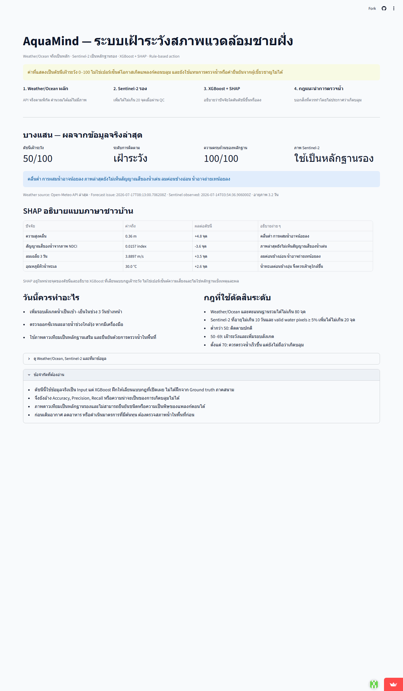

# รายงานฉบับสมบูรณ์ (ฉบับปรับปรุง V2)

## โครงการ AquaMind

### แพลตฟอร์มพยากรณ์การเกิดแพลงก์ตอนบลูมและวิเคราะห์คุณภาพน้ำแบบ End-to-End จากภาพถ่ายดาวเทียม

**ชื่อภาษาอังกฤษ:** AquaMind: End-to-End Algal Bloom Prediction and Water Quality Analysis Platform via Satellite Imagery  
**การแข่งขัน:** การแข่งขันพัฒนาโปรแกรมคอมพิวเตอร์แห่งประเทศไทย ครั้งที่ 28 (NSC 2026)  
**หมวด:** โปรแกรมเพื่องานการพัฒนาด้านวิทยาศาสตร์และเทคโนโลยี  
**ธีม:** นวัตกรรมเพื่อความยั่งยืน (Sustainable Innovation)  
**เป้าหมายการพัฒนาที่ยั่งยืน:** SDG 14 — Life Below Water ซึ่งมุ่งอนุรักษ์และใช้ประโยชน์จากมหาสมุทร ทะเล และทรัพยากรทางทะเลอย่างยั่งยืน [15]

---

## ข้อมูลเอกสาร

| รายการ | รายละเอียด |
|---|---|
| ชื่อเอกสาร | รายงานฉบับสมบูรณ์โครงการ AquaMind ฉบับปรับปรุงจากการวิเคราะห์จุดบอด |
| เวอร์ชัน | 2.0 |
| วันที่จัดทำ | 16 กรกฎาคม 2569 |
| สถานะระบบที่รายงาน | MVP v1.0 ใช้ข้อมูลจำลองและสถานการณ์สาธิต |
| สถานะการตรวจภาคสนาม | ยังไม่แล้วเสร็จ ต้องเก็บ Ground Truth และทดสอบกับเหตุการณ์จริงเพิ่มเติม |
| สถานะสมมติฐานธุรกิจ | ยังไม่พิสูจน์ Product–market fit, ผู้จ่ายเงิน, Willingness to pay และ Unit economics |
| สถานะเมื่อไม่มีภาพ | ยังไม่มีหลักฐานความแม่นยำ; ต้องใช้ No-image model และ Validation แยกก่อนแสดงค่าความเสี่ยง |

> **หมายเหตุสำคัญ:** รายงานนี้แยกผลที่ทดสอบได้จากซอร์สโค้ดปัจจุบันออกจากเป้าหมายของระบบฉบับใช้งานจริงอย่างชัดเจน ตัวเลขจากข้อมูลจำลองไม่ใช้ยืนยันความแม่นยำในการเกิดแพลงก์ตอนบลูมภาคสนาม และการมีข้อมูลอากาศ/SST ไม่ได้พิสูจน์ว่าระบบยังแม่นเมื่อไม่มีภาพดาวเทียม

---

# กิตติกรรมประกาศ (Acknowledgement)

โครงการ **“AquaMind: แพลตฟอร์มพยากรณ์การเกิดแพลงก์ตอนบลูมและวิเคราะห์คุณภาพน้ำแบบ End-to-End จากภาพถ่ายดาวเทียม”** ได้รับทุนอุดหนุนโครงการการแข่งขันพัฒนาโปรแกรมคอมพิวเตอร์แห่งประเทศไทย ครั้งที่ 28 จาก **สำนักงานพัฒนาวิทยาศาสตร์และเทคโนโลยีแห่งชาติ (สวทช.)** คณะผู้พัฒนาขอขอบพระคุณสำนักงานพัฒนาวิทยาศาสตร์และเทคโนโลยีแห่งชาติที่ให้การสนับสนุนทุนและเปิดโอกาสให้เยาวชนพัฒนาผลงานด้านวิทยาศาสตร์ เทคโนโลยี และนวัตกรรมเพื่อแก้ปัญหาสิ่งแวดล้อมและชุมชน

คณะผู้พัฒนาขอขอบพระคุณอาจารย์ที่ปรึกษาที่ให้คำแนะนำด้านการกำหนดขอบเขตโครงการ การออกแบบกระบวนการพัฒนาซอฟต์แวร์ และการนำเสนอผลงาน ตลอดจนหน่วยงานด้านประมง ทรัพยากรทางทะเล อุตุนิยมวิทยา และภูมิสารสนเทศที่เผยแพร่ข้อมูลและองค์ความรู้ซึ่งเป็นพื้นฐานสำคัญของโครงการ

สุดท้ายนี้ คณะผู้พัฒนาขอขอบคุณเกษตรกรผู้เพาะเลี้ยงสัตว์น้ำและผู้ใช้งานเป้าหมาย ซึ่งข้อเสนอแนะและประสบการณ์ภาคสนามจะมีส่วนสำคัญต่อการทดสอบ ปรับปรุง และพัฒนา AquaMind ให้เป็นเครื่องมือสนับสนุนการตัดสินใจที่เหมาะสมกับบริบทของประเทศไทยต่อไป

---

# 1. บทคัดย่อ คำสำคัญ และ Abstract

## 1.1 บทคัดย่อภาษาไทย

ปรากฏการณ์แพลงก์ตอนบลูมและภาวะออกซิเจนละลายในน้ำต่ำส่งผลกระทบต่อการเพาะเลี้ยงสัตว์น้ำชายฝั่ง โดยเกษตรกรมักได้รับข้อมูลไม่ทันต่อการเตรียมอุปกรณ์ ตรวจคุณภาพน้ำ หรือวางแผนลดความเสียหาย ระบบเฝ้าระวังที่มีอยู่บางส่วนมีความละเอียดเชิงพื้นที่ไม่เหมาะกับบริเวณฟาร์ม ขณะที่การลงพื้นที่เก็บตัวอย่างมีต้นทุนสูงและไม่สามารถทำได้ต่อเนื่องทุกจุด โครงการ AquaMind จึงมุ่งพัฒนาเครื่องมือสนับสนุนการตัดสินใจที่รวมข้อมูลภาพดาวเทียม ข้อมูลอากาศ ข้อมูลสมุทรศาสตร์ และข้อมูลภาคสนาม เพื่อประเมินความเสี่ยงการเกิดแพลงก์ตอนบลูมล่วงหน้า 3–5 วัน พร้อมอธิบายปัจจัยที่สัมพันธ์กับผลประเมินและเสนอขั้นตอนตรวจสอบหลังได้รับการแจ้งเตือน

แนวทางปัจจุบันกำหนดให้ Weather/Ocean forecast จาก Open-Meteo เป็นข้อมูลหลักตามพิกัด [23], [24] เพื่อให้ระบบยังประเมินสภาพแวดล้อมได้เมื่อไม่มีภาพ ส่วน Sentinel-2 เป็นหลักฐานรองที่ใช้เฉพาะเมื่ออายุภาพไม่เกิน 10 วันและสัดส่วนพิกเซลน้ำที่ผ่าน QC ไม่น้อยกว่า 5% ดาวเทียมมีรอบกลับมาถ่ายพื้นที่เดิมตามปกติประมาณ 5 วันและภาพอาจถูกเมฆบัง [25] จึงไม่เติมค่าภาพหรือใช้ภาพเก่าเสมือนเป็นปัจจุบัน Sentinel-2 มีแถบคลื่นความละเอียด 10–20 เมตร โดย NDCI ใช้ Band 5 และ Band 4 จึงมีความละเอียดเชิงสารสนเทศ 20 เมตร [3], [10]

MVP ที่พัฒนาแล้วใช้ระบบเดียวกันทุกพื้นที่: รับ Weather/Ocean forecast จริงเป็น Feature หลัก, รับ Sentinel-2 L2A ผ่าน Earth Search เป็น Feature รองเมื่อผ่าน QC [22], ใช้ XGBoost regression เรียนเลียนแบบกฎดัชนีเฝ้าระวังที่เปิดเผย และใช้ SHAP อธิบายผลเป็น “จุดของดัชนี” พร้อมแปลเป็นภาษาชาวบ้าน [9], [12] คะแนนฐานและ Weather/Ocean รวมได้ไม่เกิน 80 จุด ส่วนภาพเพิ่มได้ไม่เกิน 20 จุด ผลลัพธ์เรียกว่า **ดัชนีเฝ้าระวังสภาพแวดล้อม 0–100** ไม่ใช่ Probability ของการเกิด Bloom หรือค่าความแม่นยำภาคสนาม Rule layer แปลงระดับต่ำกว่า 50, 50–69 และตั้งแต่ 70 เป็นคำแนะนำติดตามปกติ เพิ่มรอบสังเกต หรือตรวจน้ำเร็วขึ้นตามลำดับ โดยไม่ประกาศว่าเกิด Bloom การทดสอบข้อมูลจริงเวลา 14:42 น. วันที่ 17 กรกฎาคม 2569 ได้ชลบุรี 50.2/100, ศรีราชา 46.5/100 และบางแสน 50.5/100 โดยบางแสนอยู่ระดับ “เฝ้าระวัง” พร้อมคำแนะนำสังเกตน้ำเช้า–เย็นและตรวจ DO ใกล้รุ่ง Ground truth ที่ยืนยันแล้วมี 0 แถว จึงยังไม่สร้าง Operational Bloom probability การทดสอบ Backend ผ่าน 11 tests ส่วน Frontend ผ่าน ESLint และ Production build

การพิสูจน์ประสิทธิภาพขั้นถัดไปจะใช้ Ground Truth ที่จับคู่วันเวลาและพิกัดกับภาพดาวเทียม แบ่ง Train/Validation/Test ตามเวลาและพื้นที่ ใช้ SMOTE เฉพาะชุดฝึก และรายงาน Recall, Precision, F1-score, PR-AUC, Calibration, Brier Score, False Alarm และช่วงความเชื่อมั่น 95% เพื่อให้การกล่าวถึงความแม่นยำมีหลักฐานรองรับ

สำหรับช่วงที่ไม่มีภาพ โครงการจะไม่ใช้โมเดลเต็มโดยเติมค่าภาพเก่าแล้วถือว่าประสิทธิภาพคงเดิม แต่จะฝึกและประเมิน **No-image model** แยกจาก Full model ทำ Calibration แยกตามอายุภาพ และหยุดแสดงค่าความเสี่ยงระดับฟาร์มหากไม่ผ่านเกณฑ์ที่กำหนดไว้ล่วงหน้า นอกจากนี้ โครงการยอมรับว่าสมมติฐานด้านผู้ซื้อ ความสามารถในการลงมือหลังแจ้งเตือน ความเต็มใจจ่าย ต้นทุนต่อฟาร์ม และช่องทางนำระบบไปใช้ยังไม่ได้พิสูจน์ จึงเพิ่มแผน Customer discovery, Paid pilot และ Unit-economics validation เป็นเงื่อนไขก่อนขยายระบบ

**คำสำคัญ:** แพลงก์ตอนบลูม, Sentinel-2, NDCI, ระบบเตือนภัยล่วงหน้า, XGBoost, Explainable AI, SHAP, ระบบสนับสนุนการตัดสินใจ

## 1.2 English Abstract

Algal blooms and low dissolved oxygen can cause substantial losses to coastal aquaculture. Farmers often receive information too late to inspect water quality, prepare aeration equipment, or plan risk-reduction actions. Existing monitoring products may lack sufficient spatial detail for farm areas, while field sampling is costly and cannot continuously cover every location. AquaMind is therefore designed as a decision-support platform that integrates satellite imagery, weather, regional oceanographic information, and field observations to estimate algal-bloom risk three to five days ahead. The system also explains the factors associated with each estimate and provides a verification-and-response checklist for farmers.

The implemented design is weather-first. Open-Meteo weather and marine forecasts are the primary inputs for every selected coordinate [23], [24], while Sentinel-2 is optional secondary evidence used only when image age and valid-water-pixel quality gates pass [22]. Sentinel-2 normally revisits an area approximately every five days, and cloud cover can extend the gap [25]; therefore, AquaMind does not impute an image or present an old map as current evidence.

The current MVP uses one shared pipeline across FastAPI, Next.js, and Streamlit. An XGBoost regressor learns a disclosed expert-rule environmental-watch index in which weather/ocean plus the base score contribute at most 80 points and quality-gated Sentinel-2 contributes at most 20 points. Request-level SHAP values explain the output in watch-index points and are translated into farmer-readable sentences [9], [12]. The output is explicitly not a bloom probability. A live test at 14:42 on 17 July 2026 produced 50.2/100 for Chonburi, 46.5/100 for Sriracha, and 50.5/100 for Bangsaen; the latter used quality-gated Sentinel-2 as secondary evidence. Because there are zero verified ground-truth rows, AquaMind still makes no operational field-accuracy or bloom-probability claim. All eleven backend tests, Streamlit AppTest, frontend ESLint, and the production build passed.

The next validation phase will pair satellite observations with time- and location-matched ground truth, apply spatial and temporal Train/Validation/Test separation, restrict SMOTE to training folds, and report Recall, Precision, F1-score, PR-AUC, calibration, Brier score, false alarms, and 95% confidence intervals. This process is required before AquaMind can make a supported claim about field accuracy.

When usable imagery is unavailable, accuracy is currently unknown. AquaMind will therefore train and validate a separate no-image model, calibrate each data-age mode independently, and suppress farm-level probabilities whenever the pre-registered acceptance criteria are not met. The project also treats customer, payer, willingness-to-pay, response capacity, acquisition channel, and unit-economics assumptions as unvalidated hypotheses. Customer discovery, actionability trials, and paid pilots are required before scale-up.

**Keywords:** Algal Bloom, Sentinel-2, NDCI, Early Warning, XGBoost, Explainable AI, SHAP, Decision Support System

---

# 2. บทนำ

## 2.1 แนวคิดของโครงการ

AquaMind มีแนวคิดหลักคือเปลี่ยนข้อมูลสิ่งแวดล้อมหลายแหล่งให้เป็นข้อมูลประกอบการตัดสินใจที่เกษตรกรเข้าใจและนำไปตรวจสอบต่อได้ ระบบไม่ได้มีเป้าหมายตัดสินใจแทนมนุษย์หรือยืนยันการเกิด Bloom แบบ 100% แต่ทำหน้าที่คัดกรองพื้นที่และช่วงเวลาที่ควรเพิ่มการเฝ้าระวัง พร้อมสื่อสารข้อจำกัดของข้อมูลอย่างตรงไปตรงมา

วงจรการทำงานประกอบด้วยการรับข้อมูล การตรวจคุณภาพ การสร้างคุณลักษณะ การประเมินความเสี่ยง การอธิบายผล การแจ้งเตือน การตอบสนองของเกษตรกร และการรับผลที่เกิดขึ้นจริงกลับมาเป็น Ground Truth เพื่อประเมินและปรับปรุงโมเดล

## 2.2 ความสำคัญของปัญหา

เมื่อแพลงก์ตอนเพิ่มจำนวนมากหรือสลายตัว ปริมาณออกซิเจนละลายในน้ำอาจลดลงและส่งผลต่อสัตว์น้ำ นอกจากนี้แพลงก์ตอนบางชนิดอาจสร้างสารพิษหรือกระทบเหงือกของสัตว์น้ำ ความรุนแรงและระยะเวลาของเหตุการณ์ขึ้นกับหลายปัจจัย เช่น อุณหภูมิน้ำ แสง สารอาหาร ความเค็ม ลม และกระแสน้ำ จึงไม่ควรประเมินจากค่าตัวแปรเดียว [18]

เกษตรกรต้องการข้อมูลที่ตอบคำถามมากกว่าคำว่า “เสี่ยง” ได้แก่ ข้อมูลมาจากเมื่อใด เหตุใดระบบจึงประเมินเช่นนั้น ระดับความเชื่อมั่นเป็นเท่าใด และควรตรวจสอบหรือเตรียมการอย่างไร การออกแบบ AquaMind จึงให้ความสำคัญกับ Data Freshness, Explainability และ Farmer Response Protocol ควบคู่กับประสิทธิภาพของโมเดล

## 2.3 ความเป็นมาของโครงการ

พื้นที่ศึกษาเบื้องต้นคือชายฝั่งอ่าวไทยตอนบน ตั้งแต่อ่าวบางปะกง จังหวัดฉะเชิงเทรา ถึงอ่าวศรีราชา จังหวัดชลบุรี ซึ่งมีการเพาะเลี้ยงสัตว์น้ำชายฝั่งและมีรายงานเหตุการณ์น้ำเปลี่ยนสีและแพลงก์ตอนบลูมในจังหวัดชลบุรี [1] ข้อมูลจากหน่วยงานภูมิสารสนเทศยังแสดงให้เห็นบทบาทของข้อมูลดาวเทียมในการติดตามคุณภาพน้ำทะเลและปรากฏการณ์น้ำเปลี่ยนสี [2] โครงการจึงเริ่มจากการพัฒนา MVP แบบ Mock Data First เพื่อพิสูจน์การไหลของข้อมูลตั้งแต่การสร้างตัวแปร การฝึกโมเดล การให้บริการ API ไปจนถึง Dashboard ก่อนเชื่อมต่อแหล่งข้อมูลจริง

MVP ทำให้ทีมสามารถตรวจสอบโครงสร้างข้อมูล การแบ่งระดับความเสี่ยง การแสดงแนวโน้ม และคำแนะนำตามสถานการณ์ได้เร็ว อย่างไรก็ตามข้อมูลจำลองไม่ครอบคลุม Noise, Domain Shift, เมฆ ตะกอน ความแตกต่างของชนิดแพลงก์ตอน และการเปลี่ยนแปลงตามฤดูกาล จึงต้องมีขั้นตอนเปลี่ยนผ่านจาก Demo ไปสู่ระบบที่ใช้ข้อมูลจริงอย่างเป็นลำดับ

## 2.4 ช่องว่างที่โครงการต้องการแก้ไข

1. ผลิตภัณฑ์ระดับสากลบางรายการมีความละเอียดหลายร้อยเมตรและอาจไม่เหมาะกับบริเวณฟาร์มขนาดเล็ก
2. Sentinel-2 มีรายละเอียดสูงกว่า แต่ไม่ได้ให้ภาพที่ใช้ได้ทุกวันและอาจถูกเมฆบัง
3. การตรวจน้ำภาคสนามครอบคลุมพื้นที่จำกัดและมีต้นทุนต่อครั้ง
4. ระบบแผนที่ทั่วไปไม่ได้อธิบายปัจจัยหรือขั้นตอนรับมือที่เหมาะกับผู้ใช้ไทย
5. การรายงาน Accuracy เพียงค่าเดียวไม่เพียงพอสำหรับเหตุการณ์ที่เกิดไม่บ่อยและอาจซ่อน False Negative

## 2.5 สมมติฐานทางธุรกิจที่ต้องพิสูจน์

รายงาน V2 ไม่ถือว่าสมมติฐานต่อไปนี้เป็นข้อเท็จจริงจนกว่าจะมีหลักฐานจากผู้ใช้หรือธุรกรรมจริง:

| สมมติฐาน | หลักฐานที่ต้องเก็บ | เกณฑ์ตัดสินใจเบื้องต้น |
|---|---|---|
| เกษตรกรเห็นแพลงก์ตอนบลูมเป็นปัญหาลำดับต้น | Problem interview แยกชนิดสัตว์และระบบเลี้ยง | ผู้ให้สัมภาษณ์ส่วนใหญ่ระบุเหตุการณ์/ความเสียหายและวิธีรับมือได้โดยไม่ถูกชี้นำ |
| Lead time 3–5 วันช่วยให้ลงมือได้ | Actionability trial และบันทึกเวลาตอบสนอง | มีกิจกรรมที่ทำได้จริงภายใน Lead time และมีต้นทุนยอมรับได้ |
| เกษตรกรเป็นผู้ใช้ แต่มีผู้จ่ายเงินที่ชัดเจน | Stakeholder map และ Buyer interview | ระบุ User, Buyer, Payer และ Approver ของ Pilot ได้ |
| ผู้ซื้อยอมจ่ายมากกว่าต้นทุนให้บริการ | Price test, Letter of Intent หรือ Paid pilot | มีหลักฐานการจ่าย/งบประมาณ ไม่ใช้ SUS แทน Willingness to pay |
| SHAP เพิ่มความเข้าใจและไม่เพิ่ม Over-trust | A/B test ของรูปแบบคำอธิบาย | ความเข้าใจ Data age/uncertainty ดีขึ้นโดยไม่เพิ่มการตัดสินใจเสี่ยง |
| ช่องทางสหกรณ์/หน่วยงานทำให้เกิด Adoption | Pilot funnel | วัด Activation, Alert acknowledgement, Retention และ Support cost ได้ |
| ระบบมีคุณค่าเหนือทางเลือกฟรี | Competitive/alternative test | ผู้ใช้เลือก Workflow ของ AquaMind ด้วยเหตุผลที่วัดได้ ไม่ใช่เพียงชอบ UI |

กลุ่มที่ต้องสัมภาษณ์แยกกันคือเกษตรกรรายย่อย ฟาร์มขนาดใหญ่ สหกรณ์ เจ้าหน้าที่ประมง หน่วยงานท้องถิ่น และผู้ซื้อ B2B แต่ละกลุ่มอย่างน้อย 5–10 รายในระยะค้นหาปัญหา การทดสอบ System Usability Scale (SUS) 30 รายใช้วัด Usability เท่านั้น ไม่ใช้ยืนยัน Product–market fit [13]

---

# 3. สารบัญ

1. [บทคัดย่อ คำสำคัญ และ Abstract](#1-บทคัดย่อ-คำสำคัญ-และ-abstract)
2. [บทนำ](#2-บทนำ)
3. [สารบัญ](#3-สารบัญ)
4. [วัตถุประสงค์และเป้าหมาย](#4-วัตถุประสงค์และเป้าหมาย)
5. [รายละเอียดของการพัฒนา](#5-รายละเอียดของการพัฒนา)
   - [5.1 เนื้อเรื่องย่อ Story Board และแบบจำลอง](#51-เนื้อเรื่องย่อ-story-board-ภาพประกอบ-แบบจำลอง-และตัวอย่างผลงาน)
   - [5.2 ทฤษฎี หลักการ และเทคโนโลยี](#52-ทฤษฎี-หลักการ-และเทคนิคหรือเทคโนโลยีที่ใช้)
   - [5.3 เครื่องมือที่ใช้ในการพัฒนา](#53-เครื่องมือที่ใช้ในการพัฒนา)
   - [5.4 รายละเอียดโปรแกรมเชิงเทคนิค](#54-รายละเอียดโปรแกรมที่พัฒนาในเชิงเทคนิค-software-specification)
   - [5.5 ขอบเขตและข้อจำกัด](#55-ขอบเขตและข้อจำกัดของโปรแกรมที่พัฒนา)
   - [5.6 คุณลักษณะอุปกรณ์](#56-คุณลักษณะของอุปกรณ์ที่ใช้กับโปรแกรม)
6. [กลุ่มผู้ใช้โปรแกรม](#6-กลุ่มผู้ใช้โปรแกรม)
7. [ผลของการทดสอบโปรแกรม](#7-ผลของการทดสอบโปรแกรม)
8. [ปัญหาและอุปสรรค](#8-ปัญหาและอุปสรรค)
9. [แนวทางพัฒนาและประยุกต์ใช้](#9-แนวทางในการพัฒนาและประยุกต์ใช้ร่วมกับงานอื่นในขั้นต่อไป)
10. [ข้อสรุปและข้อเสนอแนะ](#10-ข้อสรุปและข้อเสนอแนะ)
11. [เอกสารอ้างอิง](#11-เอกสารอ้างอิง-reference)
12. [สถานที่ติดต่อ](#12-สถานที่ติดต่อของผู้พัฒนาและอาจารย์ที่ปรึกษา)
13. [ภาคผนวก](#13-ภาคผนวก-appendix)

---

# 4. วัตถุประสงค์และเป้าหมาย

## 4.1 วัตถุประสงค์

1. พัฒนา Data Pipeline สำหรับรับ ตรวจคุณภาพ และประมวลผลข้อมูลภาพดาวเทียม ข้อมูลอากาศ ข้อมูลสมุทรศาสตร์ และข้อมูลภาคสนาม
2. พัฒนาโมเดลประเมินความเสี่ยงการเกิดแพลงก์ตอนบลูมล่วงหน้า 3–5 วัน พร้อมกลไกจัดการข้อมูลขาดหาย
3. แสดงอายุข้อมูล โหมดการประเมิน และระดับความเชื่อมั่น เพื่อไม่ให้ผู้ใช้เข้าใจข้อมูลเก่าว่าเป็นข้อมูลปัจจุบัน
4. ใช้ SHAP อธิบายทิศทางและอันดับปัจจัยที่สัมพันธ์กับผลพยากรณ์ โดยไม่ตีความเป็นเหตุและผล
5. พัฒนา Web Dashboard ภาษาไทยสำหรับแสดงระดับความเสี่ยง แนวโน้ม พื้นที่ และขั้นตอนรับมือ
6. ตรวจสอบโมเดลด้วยข้อมูลภาคสนามและเหตุการณ์ที่ไม่ถูกใช้ฝึก พร้อมรายงาน Metric ที่เหมาะกับ Rare Event
7. ทดสอบความสามารถในการใช้งานกับกลุ่มเป้าหมายอย่างน้อย 30 ราย ด้วย SUS และคำถามวัดความเข้าใจ
8. ทดสอบ Full model และ No-image model แยกกัน พร้อมกำหนดเกณฑ์หยุดแสดงผลตาม Data age
9. พิสูจน์ผู้ใช้ ผู้ซื้อ ผู้จ่ายเงิน ความสามารถในการตอบสนอง และ Willingness to pay ด้วย Customer discovery/Pilot
10. ประเมินต้นทุนรวมและ Unit economics ซึ่งรวมข้อมูล ภาคสนาม ห้องแล็บ การแจ้งเตือน Support และ Compliance

## 4.2 เป้าหมายเชิงผลงาน

| ระดับ | เป้าหมาย |
|---|---|
| MVP | ให้ข้อมูลจำลองไหลผ่าน Model → API → Dashboard และสาธิต 3 ระดับความเสี่ยงได้ |
| Prototype with real data | เชื่อม Sentinel-2, Weather API, Regional SST และ Ground Truth พร้อม Data Freshness |
| Model validation | Recall ≥ 80%, Precision ≥ 60% บน Independent Test Set และ Brier Score ดีกว่า Baseline |
| No-image validation | ผ่านเกณฑ์ Recall/Precision/Calibration แยกทุก Data-age bucket; หากไม่ผ่านต้อง Suppress probability |
| User validation | SUS ≥ 70 และผู้ใช้เข้าใจว่า Forecast ไม่ใช่การยืนยันเหตุการณ์ 100% |
| Product validation | มีหลักฐานว่า Alert นำไปสู่ Action ที่ทำได้จริง และระบุ User/Buyer/Payer/Approver ได้ |
| Commercial validation | มี Paid pilot/งบประมาณหรือหลักฐาน Willingness to pay และมี Unit economics แบบ Best/Base/Worst |
| Operational transparency | ผลลัพธ์ทุกครั้งแสดงเวลาภาพล่าสุด โหมดข้อมูล และความเชื่อมั่น |

## 4.3 เป้าหมายเชิงพื้นที่และผู้ใช้

- พื้นที่นำร่อง: ชายฝั่งอ่าวไทยตอนบน จังหวัดฉะเชิงเทราถึงจังหวัดชลบุรี
- การแสดงผลเชิงพื้นที่: ระดับบริเวณฟาร์ม โดยไม่อ้างว่าสามารถจำแนกกระชังเดี่ยวทุกขนาด
- ผู้ใช้หลัก: เกษตรกรเพาะเลี้ยงสัตว์น้ำชายฝั่ง
- ผู้ใช้สนับสนุน: เจ้าหน้าที่ประมง นักวิจัย และหน่วยงานทรัพยากรทางทะเล

## 4.4 ตัวชี้วัดผลลัพธ์และเกณฑ์หยุดโครงการ

| มิติ | ตัวชี้วัด | เกณฑ์หยุด/ปรับทิศทาง |
|---|---|---|
| วิทยาศาสตร์ | Metric บน Independent events และช่วงความเชื่อมั่น | หาก Full model ไม่ดีกว่า Baseline อย่างมีนัยสำคัญ ให้ลด Scope เป็น Monitoring/field-prioritization |
| ไม่มีภาพ | Recall, Precision, Brier/ECE แยกตามอายุภาพ | หาก No-image mode ไม่ผ่านเกณฑ์ที่ลงทะเบียนไว้ ให้แสดง “ไม่สามารถประเมิน” แทน Risk score |
| การปฏิบัติ | Actionable lead time, Alert acknowledgement, Action completion | หากผู้ใช้ไม่สามารถทำ Action ภายใน 3–5 วัน ให้ปรับ Value proposition ไม่อ้างการลดความเสียหาย |
| ธุรกิจ | Paid pilot, Sales cycle, Cost to serve, Gross margin | หากไม่มีผู้จ่ายหรือ Cost to serve สูงกว่าราคาที่ตลาดยอมรับ ให้เปลี่ยน Payer/ช่องทางหรือหยุดขยาย |
| ความปลอดภัย | อัตราคำแนะนำที่ผู้เชี่ยวชาญรับรองและ Incident | ห้าม Production หาก Protocol, Escalation และ Audit trail ยังไม่ผ่านการทบทวน |

---

# 5. รายละเอียดของการพัฒนา

## 5.1 เนื้อเรื่องย่อ (Story Board) ภาพประกอบ แบบจำลอง และตัวอย่างผลงาน

### 5.1.1 เรื่องราวการใช้งาน

1. เกษตรกรเปิด AquaMind และเลือกบริเวณฟาร์มของตน
2. ระบบแสดงระดับความเสี่ยง พร้อมเวลาที่ระบบคำนวณและเวลาของภาพดาวเทียมล่าสุด
3. หากมีภาพ Sentinel-2 ใหม่ที่ผ่านการตรวจเมฆ ระบบใช้โหมด **Fresh satellite**
4. หากยังไม่มีภาพใหม่แต่ภาพเดิมยังอยู่ในช่วงอายุที่ผ่าน Validation ระบบใช้โหมด **Forecast-assisted** และลดความเชื่อมั่น
5. หากภาพเก่าหรือข้อมูลหลักไม่ครบ ระบบใช้โหมด **Insufficient data** และไม่สร้างแผนที่ระดับฟาร์มใหม่
6. ระบบแสดง Top factors และขั้นตอนที่เกษตรกรควรตรวจสอบ เช่น สีและกลิ่นน้ำ พฤติกรรมสัตว์ และค่า DO
7. เกษตรกรส่งผลตรวจ ภาพถ่าย หรือเหตุการณ์ที่เกิดขึ้นจริงกลับเข้าสู่ระบบ
8. ผู้ดูแลตรวจสอบข้อมูลก่อนนำไปใช้เป็น Ground Truth สำหรับประเมินและปรับโมเดล

### 5.1.2 ภาพรวมระบบฉบับเป้าหมาย

```text
Weather forecast ─┐
Marine forecast ──┼─> Quality & Freshness Check ─> Weather-first Features
Sentinel-2 ───────┘        (optional secondary)             │
                                                            v
                              Environmental Watch Model + SHAP
                                                            │
                                                            v
                       Watch index + Evidence + Data Age
                                               │
                                               v
                             Dashboard / Rule Action Checklist
                                               │
                                               v
                            Farmer Feedback and Verified Outcomes
                                               │
                                               └──> Future Operational Model Evaluation
```

### 5.1.3 ภาพรวมระบบ MVP ที่พัฒนาแล้ว

```text
Open-Meteo Weather/Marine API ─> Forecast day 0–5 ───────────────┐
                                                                 │ Primary: max 75 points
Base score ───────────────────────────────────────────────────────┤ +5 points
                                                                 v
Earth Search Sentinel-2 L2A ─> NDCI + trend + age/QC ─> XGBoost rule surrogate
                                      Optional secondary: max 20 │
                                                                 ├─> SHAP in watch-index points
                                                                 ├─> Farmer-language explanation
                                                                 └─> Rule action level
                                                                        │
                                  FastAPI ─> Next.js / Streamlit ────────┘

ถ้าไม่มีภาพหรือภาพไม่ผ่าน QC: Sentinel features = missing และ Weather/Ocean path ยังทำงาน
ถ้า Weather/Ocean API และ Snapshot จริงใช้ไม่ได้: Fail closed และไม่สร้างดัชนีทดแทน
```

> MVP ปัจจุบันแสดงดัชนีเฝ้าระวังจาก Input จริงได้แล้ว แต่ดัชนีดังกล่าวเป็นคะแนนสภาพแวดล้อมจาก XGBoost ที่เลียนแบบกฎ ไม่ใช่ Probability ของ Bloom ส่วน Operational probability ยังคงถูกระงับจนกว่า Ground truth, Temporal/spatial validation และ Calibration จะผ่าน

### 5.1.4 ผล Vertical slice ข้อมูลจริงบางแสน

การรันวันที่ 17 กรกฎาคม 2569 ใช้ AOI นอกชายฝั่งบางแสนขนาดเล็ก พบภาพ Sentinel-2 ที่ผ่าน QC หลังตัด Acquisition ซ้ำ 3 วัน ได้แก่ 14 มิถุนายน, 24 มิถุนายน และ 14 กรกฎาคม 2569 ภาพล่าสุดมี NDCI median 0.015697, NDWI median 0.290950, Valid water pixel ratio 1.00 และอายุประมาณ 2.69 วัน ค่า Cloud cover ระดับ Scene เท่ากับ 75.448% แต่ AOI ผ่าน SCL water mask ครบ จึงต้องรายงานทั้ง Scene cloud และ Local valid-pixel ratio ไม่ใช้ค่าใดค่าหนึ่งแทนกัน

ระบบ Backfill Archived weather single runs ได้ครบทั้ง 3 Decision times โดยเผื่อเวลาประมวลผลภาพ 8 ชั่วโมงและเลือก Forecast run ที่ออกก่อน Decision time ข้อมูล SST คลื่น กระแสน้ำ และระดับน้ำใช้เฉพาะสถานะใกล้ Decision time ไม่ใช้ค่าจริงในอนาคต อย่างไรก็ตาม `verified_ground_truth_rows=0`, `supervised_dataset_rows=0` และ Validation report ระบุ `blocked_missing_validation_evidence` จึงไม่มี Operational model artifact

### 5.1.5 ตัวอย่างการ์ดผลลัพธ์ที่ระบบเป้าหมายต้องแสดง

```text
┌──────────────────────────────────────────────────────┐
│ ความเสี่ยง: สูง                     โอกาสเสี่ยง: 73% │
│ ภาพดาวเทียมล่าสุด: 2 วันที่แล้ว                     │
│ โหมด: Forecast-assisted          ความเชื่อมั่น: กลาง │
├──────────────────────────────────────────────────────┤
│ ปัจจัยที่ผลักคะแนนขึ้น                               │
│ 1. SST ระดับภูมิภาคสูงกว่าค่าฤดูกาล                │
│ 2. ความเร็วลมลดลงต่อเนื่อง                           │
│ 3. แนวโน้ม NDCI จากภาพล่าสุดเพิ่มขึ้น                │
├──────────────────────────────────────────────────────┤
│ ขั้นแรก: ตรวจสี/กลิ่นน้ำและวัด DO                   │
│ หาก DO ต่ำหรือสัตว์ลอยหัว ให้เพิ่มออกซิเจน          │
│ ไม่เปลี่ยนน้ำจนกว่าจะยืนยันแหล่งน้ำภายนอกปลอดภัย    │
└──────────────────────────────────────────────────────┘
```

### 5.1.5 Farmer Response Protocol

| ระดับ | การตรวจสอบและการเตรียมการ | เงื่อนไขความปลอดภัย |
|---|---|---|
| ต่ำ | ตรวจเวลาข้อมูลล่าสุดและเฝ้าสังเกตตามปกติ | ไม่เพิ่มต้นทุนจากผล AI เพียงอย่างเดียว |
| ปานกลาง | ตรวจสี/กลิ่นน้ำ พฤติกรรมสัตว์ วัด DO เตรียมเครื่องให้อากาศ และพิจารณาลดอาหารสะสม | ยืนยันภาคสนามก่อนดำเนินการที่มีต้นทุนสูง |
| สูง | ตรวจยืนยันทันที เพิ่มความถี่การวัด DO เปิดเครื่องให้อากาศเมื่อ DO ต่ำหรือสัตว์มีอาการ ลด/งดอาหารชั่วคราวตามสภาพ และติดต่อเจ้าหน้าที่ | ไม่สูบหรือเปลี่ยนน้ำจนยืนยันน้ำภายนอกปลอดภัย การย้ายกระชังหรือจับก่อนกำหนดต้องพิจารณาร่วมกับผู้เชี่ยวชาญ |
| ข้อมูลไม่เพียงพอ | ลงพื้นที่ตรวจน้ำและติดตามประกาศหน่วยงานรัฐ | ไม่ตีความแผนที่เก่าว่าเป็นสถานการณ์ปัจจุบัน |

คำแนะนำต้องปรับตามชนิดสัตว์ ระบบบ่อหรือกระชัง สภาพน้ำ และคำแนะนำของเจ้าหน้าที่ในพื้นที่ แนวทางเพิ่มออกซิเจนและลดอาหารเมื่อพบปลาลอยหัวมีตัวอย่างการใช้โดยหน่วยงานประมง แต่ระบบยังต้องให้ผู้ใช้ตรวจสภาพจริงก่อนดำเนินการ [16]

### 5.1.6 เส้นทางใช้งานเมื่อไม่มีภาพและเมื่อระบบขัดข้อง

```text
มีภาพใหม่และผ่าน QC?
├─ ใช่ → Full model → Calibration ของ Fresh mode → แสดง Risk/Confidence
└─ ไม่ใช่
   ├─ No-image model ผ่านเกณฑ์ของ Data-age bucket นี้?
   │  ├─ ใช่ → แสดง Forecast-assisted พร้อมป้ายว่าไม่ใช่การสังเกตล่าสุด
   │  └─ ไม่ใช่ → Suppress probability → แสดง “ไม่สามารถประเมินระดับฟาร์ม”
   └─ กระตุ้น Local confirmation: วัด DO/ตรวจน้ำ/ติดตามเจ้าหน้าที่

หาก Data provider หรือระบบล่ม
└─ แสดงสถานะ Degraded/Unavailable + เวลาที่ข้อมูลดีครั้งสุดท้าย
   + งดส่งข้อความที่อาจถูกตีความเป็น All clear
```

ระบบไม่ใช้สีเขียวหรือคำว่า “ปกติ” เมื่อไม่มีข้อมูลเพียงพอ เพราะผู้ใช้อาจตีความว่าไม่มีความเสี่ยง ทั้งที่ระบบเพียงมองไม่เห็นสถานการณ์

### 5.1.7 Workflow ด้านผู้ใช้และผู้จ่ายเงิน

| บทบาท | งานที่ต้องทำ | หลักฐานที่ต้องพิสูจน์ |
|---|---|---|
| เกษตรกร (User) | รับ Alert ตรวจน้ำ และดำเนินการ | มีอุปกรณ์/แรงงาน/เวลาตอบสนองจริง |
| สหกรณ์/ฟาร์มใหญ่ (Potential buyer) | จัดการหลายฟาร์มและประสานอุปกรณ์ | มีงบและเห็นมูลค่าจาก Workflow รวม |
| หน่วยงานรัฐ (Potential payer/approver) | คัดกรองพื้นที่และยืนยันประกาศ | กระบวนการจัดซื้อ ข้อมูลที่ยอมรับ และผู้รับผิดชอบชัดเจน |
| ผู้เชี่ยวชาญ/เจ้าหน้าที่ | รับรอง Protocol และ Escalation | มี Capacity ตอบสนองเมื่อ Alert สูง |

ก่อน Pilot ต้องระบุ Owner ของ Alert แต่ละระดับ ช่องทางสำรอง เวลาตอบรับ และผู้รับผิดชอบค่าใช้จ่ายจาก Action หากไม่มีผู้รับผิดชอบ ระบบจะจำกัดบทบาทเป็นข้อมูลเพื่อการทดลอง

## 5.2 ทฤษฎี หลักการ และเทคนิคหรือเทคโนโลยีที่ใช้

### 5.2.1 Remote Sensing และข้อจำกัดด้านเวลา

Sentinel-2 มี Multi-Spectral Instrument จำนวน 13 แถบคลื่น โดยแถบที่เกี่ยวข้องกับโครงการมีทั้งความละเอียด 10 และ 20 เมตร [3] ภารกิจ Sentinel-2 ออกแบบให้ใช้ดาวเทียมคู่เพื่อเพิ่มความถี่การสังเกตพื้นที่ [25] ระบบใช้ Scene Classification Layer เพื่อช่วยกรองเมฆ เงาเมฆ และพิกเซลที่ไม่เหมาะสม การตรวจหาภาพทำได้ทุกวัน แต่ภาพที่ใช้ได้อาจห่างกันมากกว่ารอบกลับมาถ่ายตามแผน เนื่องจากเมฆ หมอกควัน หรือสัดส่วนพิกเซลน้ำที่ใช้ได้ต่ำ

ระบบจึงแยกเวลาอย่างน้อย 2 ค่า:

- `prediction_generated_at`: เวลาที่ระบบคำนวณความเสี่ยง
- `satellite_observed_at`: เวลาที่ดาวเทียมสังเกตข้อมูลที่นำมาใช้

ตัวแปร `satellite_age_days` และ `valid_pixel_ratio` ถูกนำมาใช้ทั้งในโมเดลและการสื่อสาร Confidence โดยไม่สร้างภาพสมมติแล้วนำเสนอเสมือนเป็นภาพจริง

### 5.2.2 NDCI

Normalized Difference Chlorophyll Index ใช้การสะท้อนในช่วง Red-edge และ Red เพื่อเป็นดัชนีเชิงแสงที่สัมพันธ์กับคลอโรฟิลล์ในน้ำ [10]:

```text
NDCI = (ρRedEdge - ρRed) / (ρRedEdge + ρRed)
```

สำหรับ Sentinel-2 ใช้ Band 5 (Red Edge, 20 m) และ Band 4 (Red, 10 m) ดังนั้น NDCI มีความละเอียดเชิงสารสนเทศ 20 เมตร การ Resample Band 5 ไปยังกริด 10 เมตรไม่ได้เพิ่มรายละเอียดจริง ค่าแบ่งระดับ NDCI ต้องปรับจาก Ground Truth ในพื้นที่ เพราะผลิตภัณฑ์เชิงแสงเหนือแหล่งน้ำมีความไวต่อความสอดคล้องของเซนเซอร์ วิธีประมวลผล ชนิดแพลงก์ตอน ตะกอน ความขุ่น และสภาพแสง [5] งานวิจัยที่ใช้ Sentinel-2 กับ Machine learning เพื่อประมาณ Chlorophyll-a สนับสนุนความเป็นไปได้ของแนวทาง แต่ไม่ได้ทำให้โมเดลหนึ่งพื้นที่ใช้กับอีกพื้นที่ได้โดยไม่ Calibrate [6], [7]

### 5.2.3 NDWI

Normalized Difference Water Index ใช้แยกพื้นที่น้ำออกจากพื้นดินตามแนวคิดดัชนี NDWI [8]:

```text
NDWI = (ρGreen - ρNIR) / (ρGreen + ρNIR)
```

Sentinel-2 ใช้ Band 3 และ Band 8 ซึ่งมีความละเอียด 10 เมตร NDWI ใช้สร้าง Water Mask ก่อนคำนวณดัชนีคุณภาพน้ำ แต่ยังต้องตรวจพื้นที่น้ำตื้น ชายฝั่ง และตะกอนซึ่งอาจทำให้เกิดค่าคลาดเคลื่อน

### 5.2.4 Feature Engineering

| Feature | ความหมาย | แหล่งข้อมูลเป้าหมาย |
|---|---|---|
| `ndci_current` | ค่า NDCI รอบล่าสุดที่ใช้ได้ | Sentinel-2 |
| `ndci_median_history` | ค่ามัธยฐานย้อนหลังหลายรอบ | Sentinel-2 |
| `ndci_slope` | แนวโน้มเพิ่มหรือลด | คำนวณจากอนุกรมเวลา |
| `valid_pixel_ratio` | สัดส่วนพิกเซลน้ำที่ผ่าน QC | Sentinel-2 SCL/Cloud mask |
| `satellite_age_days` | อายุภาพล่าสุด | Metadata |
| `air_temperature` | อุณหภูมิอากาศ | Weather API |
| `wind_speed_direction` | ความเร็วและทิศทางลม | Weather API |
| `precipitation` | ปริมาณฝน | Weather API |
| `regional_sst_anomaly` | SST ระดับภูมิภาคเทียบฤดูกาล | Copernicus Marine |
| `field_do` | DO จากการตรวจภาคสนาม | เกษตรกร/หน่วยงาน |

ข้อมูล SST ระดับภูมิภาคประมาณ 10 กิโลเมตรใช้เป็นบริบท ไม่ขยายแล้วอ้างเป็นค่าระดับฟาร์ม และ Sentinel-2 ไม่มีแถบ Thermal สำหรับวัดอุณหภูมิผิวน้ำโดยตรง

### 5.2.5 Random Forest และ XGBoost

Random Forest เป็น Ensemble ของ Decision Trees เหมาะสำหรับใช้เป็น Baseline ที่รองรับความสัมพันธ์ไม่เชิงเส้น [11] ส่วน XGBoost สร้างต้นไม้แบบ Gradient boosting ที่ออกแบบให้มีประสิทธิภาพและรองรับ Regularization [12] การตั้งค่าพารามิเตอร์และรูปแบบ Model artifact อ้างอิงเอกสาร XGBoost [21] โครงการจะเปรียบเทียบทั้งสองโมเดลด้วย Validation เดียวกันโดยไม่สรุปล่วงหน้าว่าโมเดลใดดีกว่า

MVP ปัจจุบันใช้ `XGBClassifier` จำนวน 100 estimators, `max_depth=4`, `learning_rate=0.1` และ objective แบบ `binary:logistic`

### 5.2.6 Imbalanced Learning และ SMOTE

เหตุการณ์ Bloom เป็น Rare Event การดู Accuracy อย่างเดียวอาจทำให้โมเดลที่ทาย “ไม่เกิด” เกือบทั้งหมดดูเหมือนมีประสิทธิภาพ SMOTE สร้างตัวอย่างสังเคราะห์ในกลุ่ม Minority จากเพื่อนบ้านใน Feature Space [14] การใช้งานที่ถูกต้องต้องแบ่งข้อมูลก่อนและใช้ SMOTE เฉพาะ Training fold เพื่อป้องกัน Data Leakage จากตัวอย่างสังเคราะห์เข้าสู่ Validation/Test

### 5.2.7 SHAP และข้อจำกัดของการอธิบาย

SHAP ใช้ Shapley values เพื่ออธิบายว่าตัวแปรแต่ละตัวผลักผลพยากรณ์จากค่าพื้นฐานไปในทิศทางใด [9] ระบบจะแสดงทิศทางและอันดับความสำคัญของปัจจัย พร้อมเก็บ `shap_output_space` ว่าเป็น Raw score, Log-odds หรือ Probability ไม่แปล SHAP เป็นสาเหตุหรือเปอร์เซ็นต์ความเสียหาย

Frontend MVP ปัจจุบันรับค่า SHAP ที่ Backend คำนวณจาก XGBoost regression ด้วย `pred_contribs=True` ต่อคำขอจริง โดยระบุ `shap_output_space=watch_index_points` ผลรวม Base value และ SHAP ตรงกับดัชนีดิบตาม Additivity test แต่ละปัจจัยมีข้อความ `plain_language` เช่น “คลื่นต่ำ การผสมน้ำอาจน้อยลง” หรือ “ลมช่วยให้น้ำถ่ายเท” เพื่อให้ผู้ใช้เข้าใจโดยไม่ต้องอ่านค่า Raw margin ค่าอายุภาพและสัดส่วนพิกเซลใช้เป็น Quality gate และไม่ถูกนำขึ้นเป็นสาเหตุในคำอธิบายสำหรับเกษตรกร SHAP ชุดนี้อธิบาย XGBoost ที่เลียนแบบกฎดัชนีเท่านั้น ไม่ใช่ Bloom probability หรือความสัมพันธ์เชิงเหตุและผล [9], [12]

### 5.2.8 การตรวจสอบความแม่นยำ

การประเมินระบบแบ่งเป็น 2 ส่วน:

1. **Retrieval validation:** ค่าที่ประมาณจากภาพ เช่น Chlorophyll-a สอดคล้องกับตัวอย่างน้ำจริงเพียงใด ใช้ MAE, RMSE, R² และ Bias
2. **Event prediction validation:** ระบบเตือน Bloom ล่วงหน้าได้ดีเพียงใด ใช้ Recall, Precision, F1-score, PR-AUC, ROC-AUC, Confusion Matrix, False Alarms และ Missed Events

แผน Validation ที่กำหนดมีดังนี้:

1. จับคู่ Ground Truth กับภาพตามวันเวลาและพิกัด
2. แบ่ง Train/Validation/Test ตามเวลาและพื้นที่ ไม่สุ่มพิกเซลข้างเคียงข้ามชุด
3. ทำ Rolling-origin validation เพื่อจำลองการทำนายอนาคต
4. กันเหตุการณ์จริงอย่างน้อยหนึ่งช่วงเป็น Independent Test Event เมื่อข้อมูลเพียงพอ
5. ปรับ Threshold จาก Validation Set เท่านั้น
6. ตรวจ Calibration ด้วย Calibration curve และ Brier Score
7. รายงานช่วงความเชื่อมั่น 95% ด้วย Bootstrap
8. แยกผลตามอายุภาพ 0–5, 6–10 และมากกว่า 10 วัน
9. เปรียบเทียบกับ Baseline ได้แก่ Majority class, NDCI threshold และ Weather-only model

### 5.2.9 สถาปัตยกรรมโมเดลเมื่อไม่มีภาพดาวเทียม

โครงการจะไม่ใช้โมเดลเดียวแล้วเติม NDCI เก่าหรือค่ากลางโดยสมมติว่าประสิทธิภาพคงเดิม แต่ใช้โมเดลและ Calibration แยกตาม Availability:

| โมเดล | Input | สิ่งที่ตอบได้ | ข้อห้าม |
|---|---|---|---|
| **Full model** | ภาพล่าสุดที่ผ่าน QC + Weather + Regional SST + History | ความเสี่ยงเมื่อมีการสังเกต Optical ล่าสุด | ห้ามใช้กับภาพเกินช่วงอายุที่ฝึก/ทดสอบ |
| **No-image model** | Weather + Regional SST + Non-leaking history + Missingness indicators | ความเสี่ยงตามสภาวะเอื้อในช่วงไม่มีภาพ | ห้ามกล่าวว่าเห็น Chlorophyll/Bloom ปัจจุบันระดับฟาร์ม |
| **Local-confirmation mode** | DO/ผลตรวจ/รายงานที่ผ่าน QC | ยืนยันสภาวะเฉพาะจุด | ห้ามรวม Feedback ที่ยังไม่ตรวจสอบเป็น Ground Truth |

การทดสอบต้องทำแบบ Paired comparison บนวันและพื้นที่เดียวกัน โดย Mask ภาพจากชุดทดสอบเพื่อจำลองการไม่มีภาพ และแยกผลตามสาเหตุการขาดภาพ/ฤดูกาล การขาดภาพจากเมฆถือเป็น **Missing Not At Random** เพราะอาจสัมพันธ์กับฝนและสภาพแวดล้อม จึงต้องมี Missingness indicators และ Stress test ช่วงมรสุม

**เกณฑ์การแสดงผล:** Full และ No-image model ต้องผ่าน Recall, Precision และ Calibration ที่ลงทะเบียนไว้ก่อนดู Test set แยกตาม Data-age bucket หากไม่ผ่าน ระบบไม่แสดง Probability และใช้ข้อความ “ข้อมูลไม่เพียงพอสำหรับการประเมินระดับฟาร์ม” การลด Confidence ด้วยกฎจำนวนวันเพียงอย่างเดียวไม่ถือเป็น Calibration

### 5.2.10 นิยาม Label, Horizon และ Data coverage

ก่อนสร้างชุดข้อมูลจริงต้องจัดทำ Label specification ดังนี้:

1. แยก **Bloom biomass**, **Harmful species/toxin**, **น้ำเปลี่ยนสี** และ **Hypoxia/DO ต่ำ** เพราะไม่ใช่ Outcome เดียวกัน
2. ระบุ Threshold และวิธีตรวจ เช่น Chlorophyll-a laboratory method, species identification, DO sensor และการรับรองเหตุการณ์
3. สร้าง Feature ณ เวลา `t` และ Label แยก `t+1`, `t+2`, …, `t+5` เพื่อพิสูจน์ Early warning โดยห้ามใช้ข้อมูลหลัง `t`
4. กำหนด Spatial unit และ Event de-duplication เพื่อไม่ให้นับพิกเซลใกล้กันเป็นเหตุการณ์อิสระจำนวนมาก
5. ทำ Sample-size/Power plan จากจำนวน **Independent events** และความกว้างช่วงความเชื่อมั่น ไม่กำหนดเพียงจำนวนจุดต่อ Campaign
6. สร้าง Coverage map แยกพื้นที่ ฤดูกาล Farm type, Risk class และ Optical water type พร้อมป้าย Out-of-support

ตัวแปรที่ต้องสำรวจ Availability และคุณค่าก่อนเพิ่ม ได้แก่ Nutrient/runoff, river discharge, tide/current, salinity, turbidity, bathymetry, water depth, farm type, species และ stocking density ทุกตัวแปรต้องผ่าน Leakage review และ Ablation test ไม่เพิ่มเพียงเพราะหาได้

### 5.2.11 Quality control สำหรับน้ำชายฝั่งและข้อมูลหลายความละเอียด

การประมวลผลต้องตรวจ Sunglint, adjacency effect จากแผ่นดิน, bottom reflectance ในน้ำตื้น, ตะกอน, Turbidity และ Atmospheric correction ซึ่งอาจทำให้ NDCI สูงโดยไม่ใช่ Bloom ระบบจะเก็บ Native resolution/footprint ของทุกแหล่ง ไม่ Resample ข้อมูล SST ประมาณ 10 km แล้วแสดงเป็นค่าระดับฟาร์ม

Ground Truth และข้อมูลแวดล้อมต้องมี Matching tolerance ที่กำหนดล่วงหน้า บันทึก Timezone, Tide phase, Sampling method และ Calibration ของเครื่องมือ ผล Validation ต้องแยกตาม Optical water type และระยะห่างชายฝั่ง พร้อมเปรียบเทียบ Algorithm/Correction อย่างน้อยหนึ่ง Baseline

ทุกระเบียนต้องเก็บ Data lineage ได้แก่ Source product ID, Processing baseline, Acquisition time, Ingestion time, Checksum, Transformation code version และ QC flags เพื่อรองรับการ Reprocess เมื่อแหล่งข้อมูลเปลี่ยนเวอร์ชัน

## 5.3 เครื่องมือที่ใช้ในการพัฒนา

### 5.3.1 เครื่องมือที่ใช้ใน MVP ปัจจุบัน

| กลุ่ม | เครื่องมือ/เวอร์ชันตามไฟล์โครงการ | หน้าที่ |
|---|---|---|
| ภาษา | Python 3.11 | สร้างข้อมูล ฝึกโมเดล และ Backend |
| Data/ML | pandas, NumPy, scikit-learn, imbalanced-learn, XGBoost | เตรียมข้อมูล SMOTE ฝึกและประเมินโมเดล |
| Backend | FastAPI, Pydantic | API และ Data validation ตามโครงสร้างของ FastAPI [19] |
| Frontend | Next.js 16.2.9, React 19.2.4, TypeScript | Dashboard ตามแนวทาง Next.js [20] |
| UI | Tailwind CSS 4, Lucide React | รูปแบบหน้าจอและไอคอน |
| Deployment tooling | npm, Next.js build tools | ติดตั้งและ Build Frontend |
| Version control | Git/GitHub | จัดการซอร์สโค้ด |

### 5.3.2 เครื่องมือสำหรับระบบฉบับเชื่อมข้อมูลจริง

| เครื่องมือ | หน้าที่ |
|---|---|
| Earth Search STAC API | แหล่งรายการ Sentinel-2 L2A COG ที่ MVP ใช้จริง [22] |
| Open-Meteo Single Runs API | ย้อน Archived forecast run ที่ออกก่อน Decision time เพื่อลด Future leakage [23] |
| Open-Meteo Marine Weather API | ดึง SST, คลื่น กระแสน้ำ และระดับน้ำสำหรับบริบทสมุทรศาสตร์ [24] |
| Google Earth Engine | ทางเลือกสำหรับค้นหา กรองเมฆ และประมวลผลข้อมูลภูมิสารสนเทศขนาดใหญ่ [4] |
| rasterio/GDAL | ประมวลผล Raster และพิกัด |
| xarray | อ่านข้อมูล NetCDF สมุทรศาสตร์ |
| Copernicus Marine | SST รายวันระดับภูมิภาคตามเอกสารผลิตภัณฑ์ [17] |
| Weather API/กรมอุตุนิยมวิทยา | ข้อมูลอากาศและพยากรณ์ |
| SHAP | คำนวณคำอธิบายโมเดลจริง |
| PostgreSQL/PostGIS | เก็บข้อมูลผู้ใช้ ฟาร์ม ผลพยากรณ์ และข้อมูลเชิงพื้นที่ |
| Docker/CI | ทำสภาพแวดล้อมซ้ำได้และทดสอบอัตโนมัติ |

> MVP มี `backend/requirements.txt`, `frontend/package-lock.json` และ `requirements.txt` สำหรับ Streamlit แล้ว โดย Streamlit ใช้แพ็กเกจ `xgboost-cpu` เพื่อลดขนาด Dependency บน Cloud ส่วน Production ยังต้องเพิ่มขั้นตอนสร้าง SBOM, ตรวจช่องโหว่ และอัปเดต Dependency อย่างมีรอบควบคุม

### 5.3.3 เครื่องมือด้านการดำเนินงาน ความปลอดภัย และธุรกิจที่ต้องเพิ่ม

| ความสามารถ | เครื่องมือ/แนวทาง | วัตถุประสงค์ |
|---|---|---|
| Observability | Structured logs, metrics, tracing, uptime/freshness alerts | รู้ว่าระบบล่ม ข้อมูลค้าง หรือ Alert ส่งไม่ถึง |
| Model lifecycle | Model registry, drift monitor, approval/rollback | ควบคุมรุ่นโมเดลและย้อนกลับได้ |
| Data quality | Data contracts, schema tests, lineage catalog | ตรวจการเปลี่ยน Schema/Processing baseline |
| Security | Threat model, secret manager, dependency scan, audit log | ปกป้องพิกัดฟาร์มและข้อมูลผู้ใช้ |
| Reliability | Backup/restore test, incident runbook, provider adapters | รับมือ External service ขัดข้อง |
| Product discovery | Interview guide, experiment log, analytics events | พิสูจน์ปัญหา Adoption และ Actionability |
| Financial control | Cost tags, usage meter, unit-economics worksheet | วัดต้นทุนต่อฟาร์ม/พื้นที่/Alert |

## 5.4 รายละเอียดโปรแกรมที่พัฒนาในเชิงเทคนิค (Software Specification)

### 5.4.1 สถานะส่วนประกอบ

| ส่วนประกอบ | สถานะ | หลักฐานในโครงการ |
|---|---|---|
| Synthetic data generator | พัฒนาแล้ว | `backend/generate_mock_data.py` |
| XGBoost + SMOTE training | พัฒนาแล้ว | `backend/train_model.py` |
| Model artifact | พัฒนาแล้วจาก Mock data | `backend/xgboost_model.json` |
| Station/risk API | พัฒนาแล้วระดับ MVP | `backend/main.py` |
| Time-series scenario data | พัฒนาแล้วแบบจำลอง | `backend/data/chonburi_station_a1_30d.csv` |
| Dashboard scenarios | พัฒนาแล้ว | `frontend/app/page.tsx` |
| Dashboard เชื่อม API | พัฒนาแล้ว | Next.js เรียก FastAPI ผ่าน proxy `/backend-api` พร้อม Loading/Error/Retry |
| Sentinel-2 AOI pipeline | พัฒนาแล้วระดับ Prototype | `backend/sentinel2.py`, Earth Search COG, SCL water mask, NDCI/NDWI และ Tile deduplication |
| Weather/Ocean pipeline | พัฒนาแล้วระดับ Prototype | Current forecast และ Archived Single Runs พร้อม Decision-time leakage control |
| Weather-first watch model | พัฒนาแล้ว | `backend/environmental_watch_model.json`; XGBoost regression เลียนแบบกฎดัชนี 0–100 |
| Transparent rule specification | พัฒนาแล้ว | `backend/train_watch_model.py`; Weather/Ocean+base ≤ 80 จุด, Sentinel-2 ≤ 20 จุด |
| Ground-truth/Dataset builder | พัฒนาโครงสร้างแล้ว แต่ยังไม่มีข้อมูล | Template, VERIFIED gate และ Label t+3 ถึง t+5; ปัจจุบันได้ 0 แถว |
| Validation/Calibration gate | พัฒนาแล้ว | Temporal 60/20/20, Baselines, Brier/ECE และสร้าง Operational artifact เฉพาะเมื่อผ่าน Policy |
| SHAP computation service | พัฒนาแล้วบน Input จริง | คำนวณ contribution ต่อคำขอในหน่วยจุดดัชนีและแปลเป็นภาษาชาวบ้าน |
| Authentication/Database/Notification | ยังไม่พัฒนา | ยังไม่มีโมดูลในซอร์สโค้ด |

### 5.4.2 Input Specification ของ MVP

#### A. Training CSV

| Field | Type | ความหมาย |
|---|---|---|
| `ndci_mean_7d` | float | ค่าเฉลี่ย NDCI จำลอง |
| `ndci_slope_7d` | float | แนวโน้ม NDCI จำลอง |
| `sst_anomaly` | float | SST anomaly จำลอง |
| `wind_speed_3d` | float | ความเร็วลมจำลอง |
| `ndci_x_wind` | float | Interaction feature |
| `is_bloom` | integer 0/1 | ป้ายกำกับที่สร้างจากกฎ |

ไฟล์ `backend/mock_data.csv` มี 1,000 ระเบียน แบ่งเป็น Non-bloom 898 และ Bloom 102 ระเบียน

#### B. Time-series CSV

ประกอบด้วย `date`, `ndci`, `ndci_mean_7d`, `ndci_slope_7d`, `sst_anomaly`, `wind_speed_3d`, `risk_score`, `risk_level`, `alert_status` และ `do_value` จำนวน 14 แถว

#### C. API input

```http
GET /api/stations
GET /api/risk/current?station_id=chonburi_01
```

`station_id` ที่กำหนดใน MVP ได้แก่ `chonburi_01`, `chonburi_02` และ `chonburi_03`

### 5.4.3 Output Specification ของ MVP

```json
{
  "station_id": "chonburi_01",
  "assessment_status": "environmental_watch",
  "risk_score": 50.5,
  "score_label": "ดัชนีเฝ้าระวังสภาพแวดล้อม (ไม่ใช่โอกาสเกิดบลูม)",
  "score_is_probability": false,
  "risk_level": "เฝ้าระวัง",
  "alert_status": "Environmental watch — ต้องตรวจน้ำก่อนยืนยัน",
  "shap_explanation": "กระแสน้ำค่อนข้างอ่อน จึงควรตรวจสภาพน้ำ ...",
  "location": "Bangsaen — Weather-first + Sentinel-2 Live Watch",
  "lat": 13.3611,
  "lon": 100.9234,
  "timestamp": "2026-07-17T...Z",
  "recommendations": ["..."],
  "features": [
    {"name": "ความสูงคลื่น", "value": 0.66, "unit": "m", "impact": "increase", "shap_value": 3.7, "plain_language": "คลื่นต่ำ การผสมน้ำอาจน้อยลง"}
  ],
  "data_status": "live_watch",
  "analysis_method": "weather_first_xgboost_shap_rule_watch",
  "confidence_score": 100,
  "model_version": "weather-first-rule-surrogate-v1",
  "shap_output_space": "watch_index_points"
}
```

### 5.4.4 Output Specification ที่ต้องเพิ่มในระบบฉบับจริง

```json
{
  "prediction_generated_at": "ISO8601",
  "satellite_observed_at": "ISO8601|null",
  "satellite_age_days": 2,
  "valid_pixel_ratio": 0.82,
  "data_mode": "FRESH_SATELLITE|FORECAST_ASSISTED|INSUFFICIENT_DATA",
  "model_mode": "FULL|NO_IMAGE|NONE",
  "confidence_level": "HIGH|MEDIUM|LOW",
  "risk_probability": "number|null",
  "suppression_reason": "string|null",
  "coverage_status": "IN_SUPPORT|OUT_OF_SUPPORT|UNKNOWN",
  "model_version": "string",
  "calibration_version": "string",
  "shap_output_space": "raw|probability",
  "source_footprints": [{"source": "SST", "native_resolution_km": 10}],
  "lineage_id": "string",
  "action_checklist": ["verify_water", "measure_do", "prepare_aeration"]
}
```

### 5.4.5 Functional Specification

#### ฟังก์ชันที่ทำงานแล้ว

1. สร้าง Mock dataset แบบ Class imbalance
2. แบ่ง Train/Test แบบ Stratified random split
3. ใช้ SMOTE กับชุดฝึก
4. ฝึก XGBoost และบันทึก Model artifact
5. แสดง Classification report และ ROC-AUC
6. คืนรายการสถานีที่ใช้โหมด Weather-first เดียวกันผ่าน FastAPI
7. คืน Environmental watch response พร้อมคำอธิบายภาษาชาวบ้านและ Rule action
8. คืน HTTP 404 เมื่อไม่พบสถานี
9. เลือกพื้นที่แล้วดึง Weather/Ocean จริงตามพิกัด
10. แสดง Watch-index gauge, SHAP factor, Data lineage, Rule basis และ Debug panel

#### ฟังก์ชันที่ต้องพัฒนาต่อ

1. รับ Feedback ภาคสนามพร้อมการตรวจสอบ
2. สร้าง Ground truth ตาม Outcome definition ที่ผู้เชี่ยวชาญรับรอง
3. ฝึก Operational Bloom model และ No-image model จากเหตุการณ์จริง
4. ทำ Temporal/spatial validation และ Probability calibration
5. Authentication, Database, Notification และ Audit log
6. Export รายงานและรองรับหลายฟาร์ม

### 5.4.6 โครงสร้างซอฟต์แวร์ปัจจุบัน

```text
aqua_mind/
├── AquaMind_Proposal_Formatted.md
├── AquaMind_Final_Report.md
├── mvp_task.md
├── backend/
│   ├── main.py
│   ├── generate_mock_data.py
│   ├── train_model.py
│   ├── mock_data.csv
│   ├── xgboost_model.json
│   ├── requirements.txt
│   └── data/
│       └── chonburi_station_a1_30d.csv
└── frontend/
    ├── app/
    │   ├── page.tsx
    │   ├── layout.tsx
    │   └── globals.css
    ├── package.json
    ├── package-lock.json
    └── next.config.ts
```

### 5.4.7 โครงสร้างซอฟต์แวร์เป้าหมาย

```text
External data sources
       │
       v
Scheduled ingestion and quality control
       │
       v
Feature store / PostgreSQL-PostGIS
       │
       ├──> Training and validation pipeline
       │
       └──> Versioned inference service ─> SHAP/Calibration
                                          │
                                          v
                              FastAPI ─> Dashboard/Notification
                                          │
                                          v
                                  Verified field feedback
```

### 5.4.8 ส่วนที่ทีมพัฒนาขึ้นเอง

1. การกำหนดปัญหาและ User flow สำหรับระบบเฝ้าระวังแพลงก์ตอนบลูม
2. สคริปต์สร้างข้อมูลจำลองตาม Feature ของโครงการ
3. กระบวนการฝึก XGBoost และ SMOTE สำหรับ MVP
4. โครงสร้าง API, Model service, Assessment gate และคำแนะนำเพื่อความปลอดภัย
5. Dashboard ระบบ Weather-first, SHAP ภาษาชาวบ้าน, Rule action และ Model & Data Inspector
6. แนวคิด Data mode, Data freshness, Confidence และ Farmer Response Protocol ในเอกสารออกแบบ

### 5.4.9 Source Code และองค์ประกอบจากภายนอก

| องค์ประกอบ | แหล่งที่มา/สัญญาอนุญาตที่ต้องตรวจในรุ่นส่งมอบ | การใช้งาน |
|---|---|---|
| Python | Python Software Foundation License | Runtime |
| FastAPI | MIT License | Backend framework |
| Pydantic | MIT License | Schema validation |
| pandas | BSD 3-Clause | Data processing |
| NumPy | BSD 3-Clause | Numerical computing |
| scikit-learn | BSD 3-Clause | Split/Metrics |
| imbalanced-learn | MIT License | SMOTE |
| XGBoost | Apache License 2.0 | ML model |
| Next.js | MIT License | Frontend framework |
| React | MIT License | UI library |
| Tailwind CSS | MIT License | Styling |
| Lucide | ISC License | Icons |
| Sentinel-2/Copernicus data | Copernicus data terms | Remote sensing data |

ทีมไม่ได้คัดลอก Source Code ของบุคคลภายนอกมาแนบในรายงาน รายการ Dependency จริงต้องสร้างจาก Lock file/Environment และตรวจ License ซ้ำก่อนเผยแพร่หรือให้บริการเชิงพาณิชย์

### 5.4.10 Non-functional Specification และ SLO เบื้องต้น

ตัวเลข SLO ต่อไปนี้เป็นค่าออกแบบสำหรับ Pilot ต้องปรับจากความต้องการผู้ใช้และต้นทุนจริง:

| ด้าน | ตัวชี้วัด | พฤติกรรมเมื่อไม่ผ่าน |
|---|---|---|
| Data freshness | อายุของแต่ละแหล่งเทียบเกณฑ์โหมด | ลดโหมด/Suppress prediction ไม่ใช้ค่าเก่าเงียบ ๆ |
| Availability | ความพร้อมของ API/Dashboard/Alert channel | แสดง Degraded/Unavailable และเวลาข้อมูลดีล่าสุด |
| Alert delivery | Delivered และ Acknowledged rate | Retry ผ่านช่องทางสำรองและ Escalate ตาม Protocol |
| Recovery | RTO/RPO ที่กำหนดตาม Pilot | ใช้ Backup/restore และ Incident runbook |
| Traceability | Prediction ทุกครั้งมี Model/Data lineage | ห้ามใช้ผลที่ย้อนกลับแหล่งข้อมูลไม่ได้ |
| Security | ไม่มี Secret ใน Source, จำกัด CORS/สิทธิ์ | ห้ามเปิด Public service จนผ่าน Security review |

ระบบต้องมี Health endpoint, freshness monitor, alert-delivery log, provider-status dashboard, backup test, incident owner และ Post-incident review การแสดงผลล้มเหลวต้อง Fail closed: ไม่ใช้สีเขียวหรือ “ปกติ” เมื่อระบบไม่มีข้อมูล

### 5.4.11 Data-provider และ Model lifecycle

ก่อนเชื่อมผู้ให้บริการแต่ละรายต้องมีทะเบียน `SLA/latency`, Quota, Cost, License/Terms, Data retention, Geographic coverage, Replacement source และผลกระทบหากหยุดให้บริการ การเข้าถึงต้องผ่าน Adapter ไม่ผูก Business logic กับ API รายเดียว

Model lifecycle ประกอบด้วย Versioned dataset, Feature/label definition, Model registry, Validation report, Approval, Champion–challenger, Drift monitoring และ Rollback การเปลี่ยนโมเดล/Threshold/Calibration ต้องมี Audit log และห้ามเรียนรู้จาก Feedback ที่ยังไม่ผ่าน Reviewer

### 5.4.12 Security, privacy และ Feedback governance

ข้อมูลพิกัดฟาร์ม เบอร์โทร ภาพถ่าย และผลผลิตถูกจัดเป็นข้อมูลอ่อนไหวเชิงธุรกิจ ระบบต้องทำ Threat model, Data classification, Least privilege, Encryption, Consent/Legal-basis record, Retention/deletion policy และ Incident response ผู้ใช้ต้องเห็นว่าใครเข้าถึงพิกัดได้

Feedback ทุกชิ้นต้องมี `source`, `observed_at`, `location_accuracy`, `verification_status`, `reviewer`, `duplicate_group` และ `measurement_method` เฉพาะข้อมูลสถานะ `VERIFIED` จึงใช้ในชุดฝึก/ทดสอบได้ และต้องกันข้อมูลจากเหตุการณ์เดียวกันไม่ให้ข้าม Train/Test

## 5.5 ขอบเขตและข้อจำกัดของโปรแกรมที่พัฒนา

### 5.5.1 ขอบเขต MVP ปัจจุบัน

- สาธิตพื้นที่อ้างอิง 3 สถานีในจังหวัดชลบุรี
- ดึง Weather/Ocean forecast จริงตามพิกัดเป็น Input หลักทุกสถานี
- ใช้ Sentinel-2 จริงของ AOI บางแสนเป็นหลักฐานรองเมื่อผ่านเกณฑ์อายุและ QC
- คำนวณดัชนีเฝ้าระวัง 0–100 ด้วย XGBoost rule surrogate และอธิบายด้วย SHAP
- ให้บริการ API แบบไม่มี Authentication
- แสดงผลผ่าน Web Dashboard แบบ Responsive
- แสดง SHAP top factors เป็นภาษาชาวบ้านและคำแนะนำจาก Rule layer

### 5.5.2 ข้อจำกัด MVP

1. Sentinel-2 AOI ingestion และ SCL mask ทำงานแล้ว แต่ยังไม่มีการตรวจ Atmospheric/adjacency/sunglint correction กับข้อมูลภาคสนาม
2. Input ของหน้า Live เป็นข้อมูลจริง แต่ Target ที่ใช้ฝึก Watch model มาจากกฎผู้พัฒนา ไม่ใช่ Ground truth
3. Watch index ไม่ใช่ Probability และยังอ้าง Field accuracy ไม่ได้
4. SHAP อธิบายพฤติกรรมของ XGBoost rule surrogate ไม่ได้ยืนยันเหตุและผลทางชีววิทยา
5. ยังไม่มี Operational Bloom model ที่ผ่าน Validation จึงงด Bloom probability แต่ยังแสดง Watch index ได้
6. Open-Meteo Weather/Marine เป็นข้อมูลแบบจำลองกริดหยาบกว่าระดับฟาร์ม
7. ตำแหน่งสถานีและความเหมาะสมระดับฟาร์มต้องยืนยันก่อนใช้งานจริง
8. ยังไม่มี Authentication, Production database และ Last-mile notification
9. ยังไม่มี Ground truth ที่จับคู่วัน เวลา พิกัด และชนิด/ความหนาแน่นแพลงก์ตอน
10. มี Automated backend tests 11 รายการและ Streamlit AppTest แล้ว แต่ยังไม่มี CI, Automated browser test, Authentication, Database และระบบแจ้งเตือนจริง

### 5.5.3 ข้อจำกัดระบบเป้าหมาย

1. Sentinel-2 ไม่ให้ภาพใหม่ทุกวันและเมฆอาจทำให้ช่วงว่างยาวขึ้น
2. NDCI ไม่สามารถยืนยันชนิดหรือความเป็นพิษของแพลงก์ตอนได้
3. ความละเอียด NDCI คือ 20 เมตร ไม่รับประกันการแยกกระชังเดี่ยว
4. SST ระดับภูมิภาคไม่ใช่อุณหภูมิน้ำระดับฟาร์ม
5. Watch index ปัจจุบันไม่ใช่ Probability; หากอนาคตมี Operational probability ก็ยังไม่ใช่คำยืนยันเหตุการณ์
6. ความแม่นยำขึ้นกับปริมาณและคุณภาพ Ground Truth
7. คำแนะนำต้องปรับตามชนิดสัตว์และระบบเลี้ยง
8. ระบบเป็น Decision Support ไม่แทนการตรวจน้ำหรือคำสั่งเจ้าหน้าที่

### 5.5.4 ข้อจำกัดด้านผลิตภัณฑ์ ธุรกิจ และการดำเนินงาน

1. ยังไม่มีหลักฐานว่าเกษตรกรจัดลำดับปัญหานี้สูงพอจะใช้งานต่อเนื่องหรือจ่ายเงิน
2. ยังไม่ทราบว่าผู้จ่ายคือเกษตรกร สหกรณ์ หน่วยงานรัฐ หรือธุรกิจ B2B
3. Lead time 3–5 วันยังไม่ผ่านการทดสอบว่าทำให้เกิด Action และลดความเสียหายได้
4. SUS ไม่ใช้แทน Product–market fit, Retention หรือ Willingness to pay
5. ค่าใช้จ่ายจริงยังไม่รวม Field sampling, Lab, เรือ/เดินทาง, SMS/LINE, Support, Security, Compliance, Sales และ Incident response
6. การขายให้หน่วยงานอาจมี Sales/procurement cycle ยาว และบริการสาธารณะฟรีอาจทดแทน Dashboard ได้
7. Premium API/ประกันภัยยังไม่อยู่ในขอบเขตรายได้จนกว่าจะผ่าน Multi-season validation, Traceability และ Legal review
8. การพึ่ง External providers มีความเสี่ยงด้าน Quota, Price, Terms และ Availability
9. เมื่อไม่มีภาพ ความแม่นยำยังไม่ทราบ; Weather/SST บอกสภาวะเอื้อแต่ไม่ยืนยัน Bloom เฉพาะฟาร์ม
10. Disclaimer ไม่แทน Expert-approved protocol, Audit trail หรือกระบวนการรับผิดชอบเมื่อคำแนะนำผิด

## 5.6 คุณลักษณะของอุปกรณ์ที่ใช้กับโปรแกรม

### 5.6.1 อุปกรณ์สำหรับผู้ใช้

| อุปกรณ์ | ขั้นต่ำที่แนะนำ |
|---|---|
| สมาร์ตโฟน/แท็บเล็ต | Browser รุ่นปัจจุบัน, หน้าจออย่างน้อย 360 px, อินเทอร์เน็ต 4G/Wi-Fi |
| คอมพิวเตอร์ | Browser รุ่นปัจจุบัน, RAM 4 GB ขึ้นไป, ความละเอียด 1366×768 ขึ้นไป |
| GPS | ใช้ GPS ในอุปกรณ์หรือเลือกตำแหน่งบนแผนที่ |

### 5.6.2 อุปกรณ์สำหรับพัฒนา/ให้บริการ

| อุปกรณ์ | ขั้นต่ำสำหรับ MVP | แนะนำสำหรับประมวลผลข้อมูลจริง |
|---|---|---|
| CPU | 2 cores | 4–8 cores |
| RAM | 4 GB | 8–16 GB |
| Storage | 2 GB | 50 GB ขึ้นไปหรือ Object storage |
| GPU | ไม่จำเป็น | ไม่จำเป็นสำหรับ MVP; ใช้เมื่อฝึกข้อมูลขนาดใหญ่ |
| OS | Windows/macOS/Linux | Linux server/Container |

### 5.6.3 อุปกรณ์ภาคสนาม (ถ้ามี)

- เครื่องวัด DO ที่สอบเทียบแล้ว
- เครื่องวัด pH/อุณหภูมิ/ความเค็มตามแผน Sampling
- ขวดเก็บตัวอย่างและ Cold chain สำหรับ Chlorophyll-a laboratory analysis
- สมาร์ตโฟนสำหรับบันทึกพิกัด เวลา และภาพสีน้ำ

อุปกรณ์ภาคสนามต้องบันทึกรุ่น วิธีสอบเทียบ หน่วยวัด และเวลาที่ตรวจ เพื่อใช้ประเมินคุณภาพ Ground Truth

---

# 6. กลุ่มผู้ใช้โปรแกรม

## 6.1 ผู้ใช้หลัก

**เกษตรกรผู้เพาะเลี้ยงสัตว์น้ำชายฝั่ง** ใช้ตรวจสอบความเสี่ยงบริเวณฟาร์ม ดูความสดใหม่ของข้อมูล อ่านปัจจัยที่เกี่ยวข้อง และทำ Checklist ยืนยันสภาพน้ำก่อนตัดสินใจ

## 6.2 ผู้ใช้รอง

- เจ้าหน้าที่กรมประมงและสำนักงานประมงจังหวัด ใช้ดูภาพรวมพื้นที่และติดตามรายงานภาคสนาม
- เจ้าหน้าที่ทรัพยากรทางทะเลและชายฝั่ง ใช้ประกอบการคัดกรองพื้นที่ตรวจสอบ
- นักวิจัย ใช้ตรวจข้อมูลย้อนหลัง ประเมินโมเดล และ Export ข้อมูลตามสิทธิ์
- ผู้ดูแลระบบ ใช้ตรวจคุณภาพข้อมูล รุ่นโมเดล และ Feedback ก่อนรับเป็น Ground Truth

## 6.3 ความต้องการของผู้ใช้

1. ภาษาไทยและคำอธิบายที่ไม่ใช้ศัพท์เทคนิคเกินจำเป็น
2. เห็นเวลาข้อมูลล่าสุดและความเชื่อมั่นทันที
3. แยก “สิ่งที่ดาวเทียมเห็น” จาก “สิ่งที่โมเดลคาดการณ์”
4. คำแนะนำที่ทำได้จริงและไม่ผลักให้ดำเนินการเสี่ยงจาก AI เพียงอย่างเดียว
5. ใช้งานบนมือถือในพื้นที่อินเทอร์เน็ตไม่เสถียร
6. ติดต่อหน่วยงานที่เกี่ยวข้องได้เมื่อความเสี่ยงสูง

## 6.4 การแบ่งกลุ่มลูกค้าและแผน Customer discovery

| กลุ่ม | บทบาทที่คาด | สมมติฐานที่ต้องพิสูจน์ | วิธีทดสอบ |
|---|---|---|---|
| เกษตรกรรายย่อย | User | ใช้ Alert และทำ Field check ได้ | Problem/Workflow interview และ Usability pilot |
| ฟาร์มขนาดใหญ่/สหกรณ์ | User+Buyer | ยอมจ่ายเพื่อดูหลายฟาร์มและจัดการ Alert | Prototype test, Price test, Paid pilot |
| หน่วยงานรัฐ/ท้องถิ่น | Payer/Approver | ใช้คัดกรองพื้นที่และมีงบดูแลระบบ | Procurement interview และ Letter of Intent |
| นักวิจัย/ห้องแล็บ | Data/validation partner | สนับสนุน Ground Truth และ Review | Data-sharing agreement และ Sampling plan |
| บริษัทประกัน/ธุรกิจ B2B | Future buyer | ต้องการ API ที่ตรวจสอบย้อนกลับได้ | Discovery เท่านั้น จนกว่าจะมี Multi-season evidence |

การสัมภาษณ์ต้องแยก Problem interview ออกจาก Solution test เก็บ Alternative ปัจจุบัน ความถี่เหตุ ความเสียหาย ความสามารถในการตอบสนอง ต้นทุน และผู้อนุมัติงบประมาณ ตัวชี้วัด Product ได้แก่ Activation, Alert delivery/acknowledgement, Action completion, Seasonal retention, Support load และ Paid conversion ไม่ใช้จำนวนผู้ลงทะเบียนเพียงอย่างเดียว

---

# 7. ผลของการทดสอบโปรแกรม

## 7.1 สภาพแวดล้อมและวันที่ทดสอบ

การทดสอบในรายงานนี้ดำเนินการวันที่ **16 กรกฎาคม 2569** บนระบบ Windows/PowerShell ภายใน Workspace ของโครงการ โดยใช้ Python 3.11 และ Dependency ที่ติดตั้งอยู่ในเครื่องทดสอบ สำหรับ Frontend ใช้คำสั่งจาก `package.json` ของโครงการ

## 7.2 ผลทดสอบข้อมูลและโมเดลจำลอง

### 7.2.1 ชุดข้อมูล

| รายการ | ผล |
|---|---:|
| จำนวนข้อมูลทั้งหมด | 1,000 ระเบียน |
| Non-bloom | 898 ระเบียน |
| Bloom | 102 ระเบียน |
| Test set | 200 ระเบียน |
| Non-bloom ใน Test set | 180 ระเบียน |
| Bloom ใน Test set | 20 ระเบียน |

### 7.2.2 ผลจาก `backend/train_model.py`

| Metric | Class 0 | Class 1 | ภาพรวม |
|---|---:|---:|---:|
| Precision | 1.00 | 1.00 | 1.00 |
| Recall | 1.00 | 1.00 | 1.00 |
| F1-score | 1.00 | 1.00 | 1.00 |
| Accuracy | — | — | 1.00 |
| ROC-AUC | — | — | 1.0000 |

Model artifact หลังรันทดสอบมี Hash เดิม แสดงว่าการฝึกด้วย Seed และข้อมูลเดิมให้ผลซ้ำได้ในสภาพแวดล้อมนี้

### 7.2.3 การตีความผล

ผล 1.00 **ไม่ใช่หลักฐานว่าโมเดลแม่นยำ 100% ในสถานการณ์จริง** เนื่องจาก:

1. ป้าย `is_bloom` ถูกสร้างด้วยกฎ Deterministic จากตัวแปรในชุดข้อมูลเดียวกัน
2. ไม่มี Noise จากเมฆ ตะกอน ความคลาดเคลื่อนของเซนเซอร์ หรือ Sampling
3. แบ่งข้อมูลแบบสุ่ม ไม่ได้แยกตามเวลาและพื้นที่
4. ไม่มีเหตุการณ์จริงที่โมเดลไม่เคยเห็น
5. Distribution ของข้อมูลจำลองถูกควบคุมด้วยโค้ดเดียวกัน

ผลนี้ยืนยันได้เพียงว่า Data loading, Train/Test split, SMOTE, XGBoost, Metric calculation และ Model saving ทำงานครบตาม Pipeline

## 7.3 ผลทดสอบ Backend/API

| Test case | ผลที่คาดหวัง | ผลที่ได้ | สถานะ |
|---|---|---|---|
| `GET /api/stations` | HTTP 200 และทุกสถานีใช้ระบบเดียวกัน | 3 สถานีเป็น `live_weather_watch` | ผ่าน |
| Weather-first endpoint ไม่มีภาพ | ยังได้ Watch index จาก Weather/Ocean | ได้คะแนน, Evidence 75/100 และ `no_imagery` | ผ่าน |
| Sentinel-2 secondary gate | ภาพผ่าน QC เพิ่มหลักฐานรอง | Evidence 100/100 และ `context_only` | ผ่าน |
| ภาพเก่ากว่า 10 วัน | ตัด Feature ภาพ แต่ระบบหลักยังทำงาน | Weather watch ทำงานและไม่เติมค่าภาพ | ผ่าน |
| SHAP additivity | ผลรวม Base+SHAP ตรงกับ Watch-index prediction | ตรงภายใน Tolerance | ผ่าน |
| Sentinel-2 duplicate acquisition | วันเดียวกันเหลือ Observation คุณภาพสูงสุดหนึ่งรายการ | ตัด Tile ซ้ำได้ | ผ่าน |
| Missing field report | ห้ามสร้าง Negative label | แถวถูก Exclude | ผ่าน |
| Verified t+3 event | สร้าง Positive label | Label=1 และเก็บ Event ID | ผ่าน |
| `GET /api/pipeline/status` | แสดงจำนวนข้อมูลและ Model gate | HTTP 200 | ผ่าน |
| สถานี `missing` | HTTP 404 | HTTP 404 | ผ่าน |
| Python bytecode compilation | ไม่มี Syntax error | Exit code 0 | ผ่าน |

คำสั่ง `python -m pytest backend -q` ให้ผล **11 passed**

## 7.4 ผลทดสอบ Frontend

### 7.4.1 ESLint

วันที่ 17 กรกฎาคม 2569 คำสั่ง `npm run lint` จบด้วย Exit code 0 ไม่พบ ESLint error

### 7.4.2 Production build

วันที่ 17 กรกฎาคม 2569 คำสั่ง `npm run build` จบด้วย Exit code 0 โดย Next.js compile, TypeScript check และ Static page generation ผ่านครบ

### 7.4.3 Functional UI

Dashboard เรียก FastAPI ผ่าน Next.js proxy `/backend-api` และใช้เส้นทางเดียวกันทั้ง 3 พื้นที่ ผู้ใช้เลือกพิกัดเพื่อดึง Weather/Ocean จริงเป็นหลัก ส่วน Sentinel-2 ใช้เป็นหลักฐานรองเฉพาะ AOI ที่มีภาพผ่าน QC หน้าเว็บแสดง Watch index เป็น `/100` ไม่ใช้เครื่องหมาย `%`, ระบุว่าไม่ใช่ Bloom probability, แสดง SHAP เป็น “จุดของดัชนี” พร้อมภาษาชาวบ้าน และเปิด Rule basis ให้ตรวจสอบได้

### 7.4.4 Streamlit Cloud deployment

ทีม Deploy หน้า `streamlit_app.py` ที่ https://aquamind-d8apywwzzyvy25ydmw8ufh.streamlit.app โดยใช้ Streamlit 1.59.2, `xgboost-cpu` 3.2.0 และ `httpx` 0.28.1 หน้าเดียวกันดึง Open-Meteo ล่าสุดและใช้ Snapshot จริงเป็น Fallback, ประเมินบางแสนด้วย Weather-first XGBoost rule surrogate, แสดง Sentinel-2 เป็นหลักฐานรอง, แปล SHAP เป็นภาษาชาวบ้าน และแสดงกฎคำแนะนำ การทดสอบด้วย `streamlit.testing.v1.AppTest` เปิดหน้าได้โดยไม่มี Exception/Error และพบ Metric ครบ 4 ค่า



**ภาพที่ 7-1** หน้า Streamlit Cloud ที่ Deploy จริง ณ วันที่ 17 กรกฎาคม 2569 แสดงดัชนีบางแสน 50/100 โดยไม่มีเครื่องหมายเปอร์เซ็นต์ พร้อมป้ายว่าไม่ใช่โอกาสเกิดแพลงก์ตอนบลูม Weather/Ocean API เป็นข้อมูลหลัก Sentinel-2 เป็นหลักฐานรอง และ Evidence completeness เท่ากับ 100/100 ตาราง SHAP แสดงค่าจริง ผลต่อดัชนีเป็นจำนวนจุด และคำอธิบายภาษาชาวบ้าน เช่น “คลื่นต่ำ การผสมน้ำอาจน้อยลง” ด้านล่างแสดงสิ่งที่ควรทำและกฎช่วงคะแนน 50/70 อย่างเปิดเผย

## 7.5 สรุปสถานะการทดสอบ

| ด้าน | สถานะ |
|---|---|
| Data generation | ผ่านบนข้อมูลจำลอง |
| Model training | ผ่านบนข้อมูลจำลอง |
| Model field accuracy | ยังไม่ทดสอบ |
| API primary routes | ผ่าน |
| API path portability | ผ่าน; ใช้ Path อิงตำแหน่งโมดูล |
| XGBoost inference | ผ่านบน Weather/Ocean และ Sentinel-2 Input จริง |
| SHAP additivity | ผ่านในหน่วย Watch-index points |
| No-image behavior | ผ่าน; Weather/Ocean ยังทำงานและ Evidence ลดเหลือ 75/100 |
| Sentinel-2 L2A/NDCI/NDWI AOI pipeline | ผ่านระดับ Prototype; 3 วันหลังตัด Acquisition ซ้ำ |
| Archived forecast leakage control | ผ่าน; ใช้ Single Runs ก่อน Decision time |
| Ground truth/Supervised dataset | Blocked; VERIFIED 0 แถวและ Dataset 0 แถว |
| Operational validation report | `blocked_missing_validation_evidence` |
| Frontend lint | ผ่าน |
| Frontend production build | ผ่าน |
| Frontend–Backend integration | พัฒนาแล้วผ่าน `/backend-api` |
| Streamlit Cloud | Deploy แล้ว; AppTest ผ่านและ URL ตอบ HTTP 200 |
| User testing/SUS | ยังไม่ดำเนินการ |
| Field validation | ยังไม่ดำเนินการ |
| No-image operational accuracy | ยังไม่พิสูจน์; Watch index ทำงานได้แต่ไม่ใช่ Probability |
| Customer/payer/actionability validation | ยังไม่ดำเนินการ |
| Unit economics/paid pilot | ยังไม่ดำเนินการ |

## 7.6 แผน Acceptance Test ก่อนประกาศความพร้อม

1. Backend unit/integration tests ผ่านทั้งหมด
2. Frontend lint และ production build ผ่าน
3. Dashboard เรียก API และจัดการ Loading/Error/Insufficient data ได้
4. Path และ Configuration ไม่ขึ้นกับ Current working directory
5. ไม่มีข้อความ “Real-time” เมื่อข้อมูลไม่ใช่ข้อมูลเวลาจริง
6. Validation บน Independent field test ผ่านเกณฑ์ Recall/Precision/Calibration
7. ทดสอบผู้ใช้ 30 รายและ SUS ≥ 70
8. ทดสอบคำแนะนำกับผู้เชี่ยวชาญด้านการเพาะเลี้ยงสัตว์น้ำ

## 7.7 แผนทดสอบความแม่นยำเมื่อไม่มีภาพ

**สถานะปัจจุบัน:** ยังไม่มีผลทดสอบ จึงตอบไม่ได้ว่า “ยังแม่น” และห้ามใช้ Metric จาก Mock data สนับสนุนข้ออ้างนี้

| การทดลอง | วิธีการ | Metric/ผลที่ต้องรายงาน |
|---|---|---|
| Full vs No-image paired test | ใช้ Test events เดียวกัน ฝึกโมเดลแยก Feature set | Recall, Precision, PR-AUC, Brier, ECE และ 95% CI ของความต่าง |
| Staleness test | จำลองภาพอายุ 0–5, 6–10, >10 วันโดยไม่ใช้ข้อมูลอนาคต | Metric/Calibration แยก bucket และ Maximum validated age |
| Cloud/monsoon stress test | ทดสอบเฉพาะช่วงไม่มีภาพจากเมฆ/ฝน | False negatives, False alarms และ Coverage |
| Sudden local event test | เหตุที่ Regional Weather/SST ไม่เปลี่ยนแต่ Ground truth เปลี่ยน | Missed-event analysis และ Trigger ของ Local confirmation |
| Ablation | Full, No satellite, Weather-only, SST-only, Last-observation baseline | คุณค่าที่เพิ่มขึ้นจริงของแต่ละแหล่ง |
| Suppression policy | ใช้ Validation กำหนด Go/No-go ก่อนเปิด Test set | สัดส่วนเวลาที่แสดงผล/งดผลและความเสี่ยงคงเหลือ |

เกณฑ์ Recall ≥ 80% และ Precision ≥ 60% ในรายงานเป็นเป้าหมายเบื้องต้น ต้องทบทวนกับผู้ใช้ตามต้นทุน False negative/False positive และใช้ร่วมกับ Calibration หาก No-image model ไม่ผ่านเกณฑ์ใน bucket ใด ค่า `risk_probability` ต้องเป็น `null` พร้อม `suppression_reason` ไม่คงค่าครั้งก่อนและไม่แสดงสีเขียว

## 7.8 แผนทดสอบผลิตภัณฑ์ การดำเนินงาน และธุรกิจ

| สมมติฐาน | การทดลอง | หลักฐานผ่าน |
|---|---|---|
| Alert นำไปสู่ Action ได้ | Shadow pilot โดยยังไม่ใช้ตัดสินใจจริง | เวลาตอบรับและ Action completion อยู่ใน Lead window |
| Explanation ช่วยโดยไม่ Over-trust | A/B test 3 รูปแบบการ์ด | เข้าใจ uncertainty/data age ดีขึ้นและไม่ทำ Action เสี่ยงเพิ่ม |
| ช่องทางส่งถึงผู้ใช้ | LINE/SMS/Web/เจ้าหน้าที่ | Delivery, acknowledgement, latency และ cost ต่อช่องทาง |
| มีผู้จ่าย | Price test/LOI/Paid pilot | มีงบหรือการชำระ ไม่ใช้ความสนใจด้วยวาจาอย่างเดียว |
| Unit economics ไปต่อได้ | Pilot usage/cost tagging | Cost per farm/alert และ Gross margin ภายใต้ Base case |
| ระบบปฏิบัติการได้ | Failure drill/Load/backup test | SLO, RTO/RPO และ Incident ownership ผ่านเกณฑ์ Pilot |

Outcome study ต้องวัด Actionable lead time, จำนวนการลงพื้นที่ที่จัดลำดับได้ดีขึ้น, ต้นทุนที่ประหยัด และความเสียหายที่หลีกเลี่ยงโดยใช้ Comparison group เท่าที่จริยธรรมและการปฏิบัติเอื้อ ไม่สรุปผลจากความพึงพอใจเพียงอย่างเดียว

---

# 8. ปัญหาและอุปสรรค

## 8.1 ปัญหาด้านข้อมูลดาวเทียม

Sentinel-2 ไม่ได้สังเกตพื้นที่เดิมทุกวัน และภาพอาจใช้ไม่ได้จากเมฆ เงาเมฆ หรือหมอกควัน การแก้ปัญหาไม่ควรนำค่าที่ Interpolate มาแสดงเป็นภาพจริง AquaMind จึงกำหนดโหมดข้อมูลและแสดงอายุภาพ โดยใช้ข้อมูลอากาศและ SST ระดับภูมิภาคเพื่อช่วยประเมินแนวโน้มเท่านั้น

**แนวทางจัดการ:** ตรวจหาภาพทุกวัน, ทำ Pixel-level quality control, เก็บภาพล่าสุดที่ใช้ได้, ใส่อายุข้อมูลเป็น Feature, ลด Confidence และเปลี่ยนเป็น Insufficient data เมื่อเกินเกณฑ์จาก Validation

## 8.2 Ground Truth มีจำกัด

เหตุการณ์ Bloom เกิดไม่บ่อยและการตรวจ Chlorophyll-a ต้องใช้กระบวนการภาคสนาม/ห้องปฏิบัติการ หากมีตัวอย่างเพียง 10–15 จุดในวันเดียวจะไม่ครอบคลุมฤดูกาลหรือเหตุการณ์ที่หลากหลาย

**แนวทางจัดการ:** เก็บ 10–15 จุดต่อ Campaign หลายรอบเวลา ครอบคลุมช่วงปกติ ช่วงเริ่มเสี่ยง และ Bloom จับคู่พิกัด/เวลาให้ใกล้ดาวเทียมผ่าน และประสานหน่วยงานที่มีข้อมูลย้อนหลัง

## 8.3 Class imbalance และ Data leakage

ข้อมูล Bloom มีสัดส่วนน้อย การใช้ Random split กับพิกเซลหรือวันที่อยู่ใกล้กันอาจทำให้ Train/Test คล้ายกันมากเกินไป และการทำ SMOTE ก่อนแบ่งข้อมูลทำให้เกิด Leakage

**แนวทางจัดการ:** แบ่งข้อมูลตามเวลา/พื้นที่ก่อนทำ Resampling ใช้ Rolling-origin validation และประเมิน PR-AUC, Recall, Precision และ False Alarm ร่วมกัน

## 8.4 Domain shift

ความสัมพันธ์ระหว่างค่าการสะท้อนแสง คลอโรฟิลล์ ตะกอน และชนิดแพลงก์ตอนอาจต่างกันตามฤดูกาลและพื้นที่ โมเดลจากพื้นที่หนึ่งไม่ควรถูกนำไปใช้กับอีกพื้นที่โดยไม่ตรวจสอบ

**แนวทางจัดการ:** ทำ External validation, ตรวจ Drift ของ Feature, Version โมเดลตามพื้นที่ และกำหนดเงื่อนไข Out-of-distribution

## 8.5 ข้อจำกัดของ MVP และโค้ดปัจจุบัน

1. Sentinel-2 AOI pipeline ทำงานแล้ว แต่ SCL water mask เพียงอย่างเดียวยังไม่ครอบคลุม Sunglint, adjacency effect, น้ำตื้น และตะกอน
2. หน้า Live ใช้ Input Weather/Ocean และ Sentinel-2 จริง แต่ XGBoost ฝึกให้เลียนแบบกฎที่ผู้พัฒนากำหนด
3. Watch index และ SHAP จึงอธิบายความเหมาะสมของสภาพแวดล้อม ไม่ใช่ Probability หรือ Field accuracy
4. ยังไม่มี Ground truth ภาคสนาม, Spatial/temporal validation และ Probability calibration สำหรับ Operational Bloom model
5. โหมดไม่มีภาพของ Watch index ทำงานได้ แต่ความแม่นยำของ No-image Bloom prediction ยังไม่ถูกพิสูจน์
6. Open-Meteo เป็นข้อมูลแบบจำลองกริดหยาบกว่าระดับฟาร์มและต้องตรวจ Bias กับสถานีจริง
7. API ยังไม่มี Authentication, Production database และระบบสิทธิ์
8. มี Automated backend tests แล้ว แต่ยังไม่มี Automated browser test และ CI gate
9. ยังไม่มี Last-mile notification และ Audit trail สำหรับ Production
10. การใช้งานภาคสนามต้องตรวจ Data age, ข้อจำกัด และยืนยันด้วยการตรวจน้ำ

## 8.6 ความเสี่ยงจากคำแนะนำ

การเปิดเครื่องให้อากาศ การลดอาหาร การเปลี่ยนน้ำ การย้ายกระชัง หรือการจับสัตว์ก่อนกำหนดมีผลต่างกันตามชนิดสัตว์ ระบบเลี้ยง และสภาพพื้นที่ คำแนะนำที่ไม่ผ่านผู้เชี่ยวชาญอาจเพิ่มต้นทุนหรือความเสี่ยง

**แนวทางจัดการ:** ใช้ Checklist เพื่อยืนยันภาคสนามก่อน แยกคำแนะนำตามชนิดฟาร์ม บังคับแสดง Disclaimer และให้ผู้เชี่ยวชาญ/เจ้าหน้าที่รับรอง Protocol ก่อนใช้งานจริง

## 8.7 ความเสี่ยงด้านธุรกิจและตลาด

1. **User–payer mismatch:** ผู้ใช้กับผู้จ่ายอาจเป็นคนละฝ่าย ต้องขาย Value proposition ต่างกัน
2. **Unproven actionability:** ผู้ใช้ได้รับ Alert แต่ไม่มีทุน อุปกรณ์ แรงงาน หรืออำนาจดำเนินการ
3. **Free alternatives:** ประกาศรัฐ กลุ่ม LINE เซนเซอร์ และประสบการณ์ท้องถิ่นอาจเพียงพอ
4. **Seasonality/retention:** ผู้ใช้อาจใช้เฉพาะฤดูเสี่ยงและไม่ยอมจ่ายรายเดือน
5. **Long procurement:** หน่วยงานรัฐมีรอบงบ/จัดซื้อยาวและค่า Integration/อบรมสูง
6. **Trust channel:** ผู้ใช้อาจเชื่อเจ้าหน้าที่มากกว่า AI ทำให้ต้องมี Partner ไม่ใช่ Direct-to-farmer เพียงอย่างเดียว
7. **Scope leap:** Premium API/ประกันภัยต้องการหลักฐานและ Traceability สูงกว่าระดับ Prototype

**แนวทางจัดการ:** ทำ Customer discovery, Alternative matrix, Actionability trial, A/B explanation test, Channel pilot และ Paid pilot ก่อนพัฒนา Feature เชิงพาณิชย์

## 8.8 ความเสี่ยงด้านการเงิน

ต้นทุนที่ยังไม่อยู่ในประมาณการเดิม ได้แก่ Field sampling, ห้องแล็บ, เรือ/เดินทาง, สอบเทียบอุปกรณ์, Cloud storage/egress, Raster processing, SMS/LINE, Support, Sales, Training, Security, Compliance, Legal, Insurance และ Incident response โครงการต้องคำนวณ Cost per farm/month, per monitored km² และ per alert ใน Best/Base/Worst case รวม CAC, Sales cycle, Churn/seasonality และเงินทุนหมุนเวียน

ห้ามถือ Partner contribution เป็นศูนย์บาทหากยังไม่มีข้อตกลงเป็นลายลักษณ์อักษร และต้องมี Maintenance owner, Runway, Funding milestone และ Sunset policy ก่อนรับผู้ใช้ที่พึ่งพา Alert

## 8.9 ความเสี่ยงด้านเทคนิคและการดำเนินงานที่เพิ่มใน V2

| ความเสี่ยง | ผลกระทบ | การควบคุม |
|---|---|---|
| External API เปลี่ยน/ล่ม/เกิน Quota | ข้อมูลหยุดหรือค่าใช้จ่ายเพิ่ม | Provider registry, Adapter, Cache, Replacement และ Degraded mode |
| Model/data drift | Metric ลดโดยไม่รู้ตัว | Drift monitor, periodic evaluation, approval/rollback |
| Alert ส่งไม่ถึง | ผู้ใช้พลาดเหตุ | Multi-channel, delivery receipt, acknowledgement, escalation |
| ระบบแสดง All clear ตอนข้อมูลล่ม | สร้าง False reassurance | Fail closed, unavailable state, last-good timestamp |
| Load สูงช่วงเหตุการณ์ | Latency/ค่าใช้จ่ายพุ่ง | Capacity model, load test, queue/rate limit และ cost alert |
| Feedback ผิด/ซ้ำ/ถูกบิดเบือน | Ground Truth ปนเปื้อน | Provenance, verification, duplicate/event grouping |
| ข้อมูลพิกัดรั่ว | ความเสียหายธุรกิจ/PDPA | Threat model, least privilege, encryption, retention controls |
| คำแนะนำก่อความเสียหาย | Liability/Trust | Expert approval, human escalation, audit trail, legal review |

## 8.10 ช่องว่างข้อมูลและความไม่แน่นอนเมื่อไม่มีภาพ

- Label ยังต้องแยก Biomass bloom, Harmful species, น้ำเปลี่ยนสี และ Hypoxia
- ต้องนิยาม Lead-time label แยกวัน ไม่ใช้ค่าปัจจุบันแทนการพยากรณ์
- ยังไม่มีจำนวน Independent events ที่เพียงพอหรือ Sample-size plan
- ยังขาดข้อมูล Runoff/river discharge, Tide/current, Salinity, Turbidity, Bathymetry และ Farm context
- Sunglint, adjacency effect, bottom reflectance และตะกอนอาจทำให้ NDCI ผิด
- ความละเอียด 20 m, 10 km และข้อมูลจุดภาคสนามต้องไม่ถูกผสมจนเกิด Pseudo-precision
- การไม่มีภาพจากเมฆเป็น Missing Not At Random และอาจเป็นช่วงที่ Distribution เปลี่ยน
- Weather/SST อย่างเดียวอาจพลาดเหตุที่เกิดเร็วหรือเฉพาะจุด

ดังนั้นคำตอบเชิงโครงการคือ **ยังไม่มีหลักฐานว่าระบบแม่นเมื่อไม่มีภาพ** การทำ Forecast-assisted ต้องผ่าน No-image validation และ Calibration แยก หากไม่ผ่านให้หยุดแสดงตัวเลขและขอ Local confirmation

---

# 9. แนวทางในการพัฒนาและประยุกต์ใช้ร่วมกับงานอื่นในขั้นต่อไป

## 9.1 ระยะที่ 1: ทำ MVP ให้เป็นระบบที่ทำซ้ำได้

1. ดำเนินการแล้ว: จัดทำ `requirements.txt`, แก้ Path ด้วย `Path(__file__)` และแยก Configuration ที่จำเป็นเป็น Environment variables
2. ดำเนินการแล้ว: เชื่อม Dashboard กับ API พร้อม Loading, Error และ Retry state
3. ดำเนินการแล้ว: แก้ ESLint/Production build และยกเลิกการพึ่ง Google Fonts ระหว่าง Build
4. ดำเนินการแล้ว: เพิ่ม Backend tests สำหรับ Model, SHAP, Scenario ordering, Assessment gate และ 404
5. งานถัดไป: เพิ่ม Frontend component tests, Automated browser test และ CI gate
6. งานถัดไป: จัดทำ Environment lock/Build artifact และทดสอบติดตั้งบนเครื่องสะอาด
7. งานถัดไป: เพิ่ม Structured logging, Authentication และ Production database

## 9.2 ระยะที่ 2: เชื่อมข้อมูลจริง

1. สร้าง GEE pipeline สำหรับ Sentinel-2 L2A และ SCL cloud mask
2. คำนวณ NDWI/NDCI ที่ Resolution ถูกต้อง
3. เชื่อม Weather API และ Copernicus Marine SST
4. ออกแบบ Data catalog และ Metadata ของแหล่งข้อมูล
5. เพิ่ม Data freshness, Valid pixel ratio และ Data mode ใน API/UI
6. สร้างฐานข้อมูล PostgreSQL/PostGIS
7. แยก Mock, Staging และ Production environment

## 9.3 ระยะที่ 3: Validation ภาคสนาม

1. ทำ Sampling protocol ร่วมกับผู้เชี่ยวชาญ
2. เก็บ Chlorophyll-a, DO, pH, อุณหภูมิ, ความเค็ม และภาพสีน้ำ
3. จับคู่ข้อมูลตามพิกัดและเวลา
4. สร้าง Spatial/Temporal split และ Independent Event test
5. ทำ Calibration และกำหนด Threshold ตามต้นทุน False Negative/False Positive
6. ตีพิมพ์ Model card และ Data sheet

## 9.4 ระยะที่ 4: ทดสอบผู้ใช้และการแจ้งเตือน

1. ทดสอบกับเกษตรกรและเจ้าหน้าที่อย่างน้อย 30 ราย
2. วัด SUS และ Task completion rate
3. ทดสอบว่าผู้ใช้เข้าใจ Data age, Confidence และ Forecast
4. ทดสอบข้อความแจ้งเตือนระดับต่ำ/ปานกลาง/สูง
5. ประเมิน Alert fatigue และค่าใช้จ่ายจาก False Alarm
6. ปรับ Farmer Response Protocol ตามข้อเสนอแนะผู้เชี่ยวชาญ

## 9.5 การประยุกต์ใช้ร่วมกับงานอื่น

- ระบบติดตามคุณภาพน้ำสำหรับบ่อกุ้ง บ่อปลา และกระชัง
- การสนับสนุนการจัดลำดับพื้นที่เก็บตัวอย่างของหน่วยงานรัฐ
- Dashboard สถานการณ์สิ่งแวดล้อมชายฝั่งระดับจังหวัด
- ระบบประกันภัยสัตว์น้ำแบบใช้ดัชนี เมื่อผ่านการรับรองข้อมูลและกฎหมาย
- การติดตามความขุ่น ตะกอน หรือการเปลี่ยนแปลงสีของแหล่งน้ำ
- ระบบ Citizen science สำหรับรับรายงานสีน้ำและสัตว์น้ำผิดปกติ
- งานวิจัยเปรียบเทียบ Remote sensing indices กับข้อมูลห้องปฏิบัติการ

การประยุกต์ทุกกรณีต้องประเมินข้อมูลใหม่ ไม่ใช้โมเดลเดิมโดยอัตโนมัติ

## 9.6 Stage gates ด้านผลิตภัณฑ์ ธุรกิจ และการเงิน

| Gate | ต้องมีหลักฐาน | การตัดสินใจ |
|---|---|---|
| G0 Problem | Problem interviews และ Alternative map | เลือก Segment/Problem หรือหยุด |
| G1 Actionability | Alert-to-action shadow trial | ยืนยันว่า Lead time มีความหมาย |
| G2 Scientific | Full/No-image independent validation | เลือก Mode ที่อนุญาตให้แสดงผล |
| G3 Operational | SLO, Security, Incident/backup drill | อนุญาต Closed pilot |
| G4 Commercial | Paid pilot/งบ, Unit economics Base case | เลือก Payer/Pricing/Channel |
| G5 Scale | Multi-season evidence, retention, support capacity | ขยายพื้นที่หรือคง Pilot |

แผนการเงินต้องแยก Fixed cost (พัฒนา Validation, Security, Compliance) และ Variable cost (ข้อมูล/คำนวณ/ข้อความ/Support ต่อฟาร์ม) ทำ Cash-flow Best/Base/Worst รวม Sales cycle และ Contingency ห้ามใช้ Cloud cost เพียงรายการเดียวเป็นต้นทุนรวม

Roadmap เชิงรายได้แบ่งเป็น Research prototype → Shadow operational pilot → Paid institutional pilot → Operational service ส่วน Premium API/ประกันภัยเป็น Future option และไม่รวมใน Base-case revenue จนกว่าจะมี Multi-season validation, Traceability และ Legal review

ก่อนเริ่ม Pilot ต้องมี Maintenance owner, Support hours, Funding runway, Partner agreement, Data-provider terms และ Sunset/communication policy หากโครงการหยุดให้บริการ

---

# 10. ข้อสรุปและข้อเสนอแนะ

## 10.1 ข้อสรุป

AquaMind มีกรอบแนวคิดที่เชื่อมปัญหาภาคสนามกับ Remote sensing, Machine learning, Explainable AI และการออกแบบเพื่อผู้ใช้ โดยให้ความสำคัญกับข้อจำกัดด้านรอบภาพดาวเทียมและความโปร่งใสของข้อมูล ระบบเป้าหมายไม่ได้อ้างว่าเป็น Satellite monitoring แบบ Real-time แต่ใช้การตรวจข้อมูลรายวันและลดความเชื่อมั่นตามอายุภาพ

MVP ปัจจุบันใช้ระบบเดียวกันบน FastAPI, Next.js และ Streamlit โดยให้ Weather/Ocean API จริงเป็นข้อมูลหลักทุกพื้นที่ Sentinel-2 เป็นหลักฐานรองที่ตัดออกได้เมื่อไม่มีภาพ XGBoost เรียนเลียนแบบกฎดัชนีที่เปิดเผย และ SHAP อธิบายผลเป็นจุดพร้อมภาษาชาวบ้าน Rule layer เปลี่ยนระดับเป็นคำแนะนำตรวจน้ำโดยไม่ประกาศว่าเกิด Bloom ระบบผ่าน Backend tests 11 รายการ, Streamlit AppTest, Frontend Lint และ Production build การทดสอบข้อมูลจริงบางแสนเวลา 14:42 น. วันที่ 17 กรกฎาคม 2569 ให้ Watch index 50.5/100 ระดับเฝ้าระวัง ไม่ใช่ 50.5% Probability อย่างไรก็ตาม Ground truth ที่ยืนยันแล้วและ Supervised dataset ยังมี 0 แถว จึงยังไม่มี Operational Bloom probability หรือหลักฐานความแม่นยำภาคสนาม ระบบยังอยู่ในระดับ Prototype และการดำเนินมาตรการที่มีต้นทุนต้องอาศัยการตรวจน้ำยืนยัน

การวิเคราะห์ V2 พบว่าความเสี่ยงหลักไม่ได้อยู่ที่การเลือก Algorithm เพียงอย่างเดียว แต่รวมถึงนิยาม Outcome, จำนวนเหตุการณ์จริง, Bias ของพื้นที่/ฤดูกาล, การขาดภาพแบบไม่สุ่ม, ความสามารถของผู้ใช้ในการลงมือ ผู้จ่ายเงิน Unit economics, Last-mile alert, External-provider dependency และ Liability ปัจจุบันยังไม่มีหลักฐานว่า No-image mode รักษาความแม่นยำได้ จึงต้องแยกโมเดลและ Suppress ผลเมื่อไม่ผ่านเกณฑ์

## 10.2 ข้อเสนอแนะ

1. ให้ความสำคัญลำดับแรกกับการเก็บ Ground Truth และการออกแบบ Validation ก่อนปรับโมเดลให้ซับซ้อน
2. แก้ข้อบกพร่องซอฟต์แวร์และสร้าง Automated tests ก่อนเพิ่ม Feature
3. ใช้ NDCI 20 เมตรอย่างถูกต้องและไม่อ้างความละเอียด 10 เมตรจากการ Resample
4. แสดง Data age, Data source, Confidence และ Model version ทุกผลลัพธ์
5. แยกค่าที่ตรวจวัดจริง ค่าที่ประมาณ และค่าที่พยากรณ์ด้วยสี/ป้ายที่ชัดเจน
6. ให้ผู้เชี่ยวชาญรับรองคำแนะนำตามชนิดสัตว์และระบบเลี้ยง
7. เผยแพร่ Model card ที่บอกข้อมูลฝึก Metric ข้อจำกัด และเงื่อนไขห้ามใช้
8. หลีกเลี่ยงคำว่า “แม่นยำ” จนกว่าจะผ่าน Independent field test พร้อมช่วงความเชื่อมั่น
9. ทดสอบ Full/No-image model แยกกันและทำ Calibration ตาม Data-age bucket
10. ทำ Customer discovery, Actionability trial และ Paid pilot ก่อนสรุป Business model
11. ทำ Unit economics รวมต้นทุนภาคสนาม Support Security และ Compliance
12. เพิ่ม SLO, Monitoring, Incident/Backup, Provider exit plan และ Model rollback ก่อน Closed pilot

## 10.3 เงื่อนไข Go/No-go

โครงการเข้าสู่ Closed operational pilot ได้เมื่อมีข้อมูลจริงและ Pipeline ครบ, Frontend/Backend เชื่อมกัน, Protocol ผ่านผู้เชี่ยวชาญ, Security/SLO ผ่าน และ Full model ผ่าน Independent validation โหมด No-image เปิดใช้ได้เฉพาะ Data-age bucket ที่ผ่านเกณฑ์ของตนเอง

โครงการยังไม่ควรขยายเชิงพาณิชย์หากไม่สามารถระบุผู้จ่ายเงิน ไม่มี Action ที่ผู้ใช้ทำได้ภายใน Lead time, Unit economics Base case ติดลบโดยไม่มีเหตุผลเชิงกลยุทธ์ หรือไม่มี Maintenance owner/เงินทุนรองรับ การไม่ผ่าน Gate ควรนำไปสู่การลด Scope เป็นเครื่องมือจัดลำดับการตรวจภาคสนาม ไม่ใช่การอ้างเป็นระบบเตือนระดับฟาร์ม

---

# 11. เอกสารอ้างอิง (Reference)

[1] Thai PBS. (2566). *กรมทะเลชายฝั่ง ชี้แจง “แพลงก์ตอนบลูม” เกาะล้าน จ.ชลบุรี*. https://www.thaipbs.or.th/news/content/330148

[2] GISTDA. (2566). *การติดตามคุณภาพน้ำทะเลและปรากฏการณ์น้ำเปลี่ยนสีด้วยข้อมูลดาวเทียม*. http://coastalradar.gistda.or.th/

[3] European Space Agency. (2023). *Sentinel-2 User Handbook*.

[4] Gorelick, N., et al. (2017). Google Earth Engine: Planetary-scale geospatial analysis for everyone. *Remote Sensing of Environment*, 202, 18–27.

[5] Pahlevan, N., Chittimalli, S. K., Balasubramanian, S. V., & Vellucci, V. (2019). Sentinel-2/Landsat-8 product consistency and implications for monitoring aquatic systems. *Remote Sensing of Environment*, 220, 19–29. https://doi.org/10.1016/j.rse.2018.10.027

[6] Shi, X., Gu, L., Jiang, T., Zheng, X., Dong, W., & Tao, Z. (2022). Retrieval of Chlorophyll-a Concentrations Using Sentinel-2 MSI Imagery in Lake Chagan Based on Assessments with Machine Learning Models. *Remote Sensing*, 14(19), 4924. https://doi.org/10.3390/rs14194924

[7] Abdelal, Q. (2022). Assessment of Sentinel-2 and Landsat-8 OLI for Small-Scale Inland Water Quality Modeling and Monitoring Based on Handheld Hyperspectral Ground Truthing. *Journal of Sensors*, 2022, 4643924. https://doi.org/10.1155/2022/4643924

[8] McFeeters, S. K. (1996). The Use of the Normalized Difference Water Index (NDWI). *International Journal of Remote Sensing*, 17(7), 1425–1432.

[9] Lundberg, S. M., & Lee, S. I. (2017). A unified approach to interpreting model predictions. *NeurIPS*, 30.

[10] Mishra, S., & Mishra, D. R. (2012). Normalized difference chlorophyll index: A novel model for remote estimation of chlorophyll-a concentration in turbid productive waters. *Remote Sensing of Environment*, 117, 394–406. https://doi.org/10.1016/j.rse.2011.10.016

[11] Breiman, L. (2001). Random Forests. *Machine Learning*, 45(1), 5–32.

[12] Chen, T., & Guestrin, C. (2016). XGBoost: A Scalable Tree Boosting System. *ACM SIGKDD*, 785–794.

[13] Brooke, J. (1996). SUS: A quick and dirty usability scale. *Usability Evaluation in Industry*, 189–194.

[14] Chawla, N. V., et al. (2002). SMOTE: Synthetic Minority Over-sampling Technique. *Journal of Artificial Intelligence Research*, 16, 321–357.

[15] United Nations. (2015). *Sustainable Development Goal 14: Life Below Water*.

[16] สำนักงานประมงจังหวัดสระบุรี กรมประมง. (2568). *ลงพื้นที่ตรวจสอบกรณีปลาลอยหัวและให้คำแนะนำด้านการเพิ่มออกซิเจนและลดอาหาร*. https://www4.fisheries.go.th/local/index.php/main/view_activities/9/246642

[17] Copernicus Marine Service. (2025). *Product User Manual for the Global Sea Surface Temperature Level-4 Near Real-Time Product (SST_GLO_PHY_L4_NRT_010_043)*. https://documentation.marine.copernicus.eu/PUM/CMEMS-SST-PUM-010-043.pdf

[18] NOAA National Ocean Service. (2025). *Harmful Algal Blooms (Red Tide): Frequently Asked Questions*. https://oceanservice.noaa.gov/hazards/hab/

[19] FastAPI. *FastAPI Documentation*. https://fastapi.tiangolo.com/

[20] Next.js. *Next.js Documentation*. https://nextjs.org/docs

[21] XGBoost Developers. *XGBoost Documentation*. https://xgboost.readthedocs.io/

[22] Element 84. *Earth Search STAC API — Sentinel-2 L2A Cloud-Optimized GeoTIFF catalog*. https://earth-search.aws.element84.com/v1/

[23] Open-Meteo. *Single Runs API — archived individual weather model runs*. https://open-meteo.com/en/docs/single-runs-api

[24] Open-Meteo. *Marine Weather API*. https://open-meteo.com/en/docs/marine-weather-api

[25] European Space Agency. *Sentinel-2 mission overview*. https://www.esa.int/Applications/Observing_the_Earth/Copernicus/Sentinel-2/

---

# 12. สถานที่ติดต่อของผู้พัฒนาและอาจารย์ที่ปรึกษา

> **หมายเหตุด้านข้อมูลส่วนบุคคล:** Repository เป็นสาธารณะ รายงานฉบับนี้จึงไม่เผยแพร่เบอร์โทรศัพท์ ที่อยู่ และอีเมลส่วนบุคคล ข้อมูลดังกล่าวไม่ปรากฏในเอกสารต้นทางและต้องระบุด้วยข้อมูลจริงในสำเนาที่ส่งตรงต่อผู้จัด ห้ามสร้างข้อมูลขึ้นเอง

## 12.1 อาจารย์ที่ปรึกษา

| รายการ | ข้อมูล |
|---|---|
| ชื่อ | ข้อมูลในเอกสารต้นทางระบุ “ศ. ดร. ปิยะ มหาวิทยาลัย” ซึ่งต้องยืนยันชื่อ-สกุลและคำนำหน้าก่อนส่งฉบับที่มีข้อมูลส่วนบุคคล |
| บทบาท | Project Lead & Advisor |
| สถานศึกษา/หน่วยงาน | ไม่ปรากฏในเอกสารต้นทาง — ต้องยืนยันในฉบับยื่นผู้จัด |
| ที่อยู่ไปรษณีย์ | ไม่เปิดเผยในฉบับสาธารณะ |
| โทรศัพท์ | ไม่เปิดเผยในฉบับสาธารณะ |
| โทรศัพท์มือถือ | ไม่เปิดเผยในฉบับสาธารณะ |
| อีเมล | ไม่เปิดเผยในฉบับสาธารณะ |

## 12.2 ผู้พัฒนา

| ชื่อ | หน้าที่ | โทรศัพท์มือถือ | อีเมล |
|---|---|---|---|
| นาย อิทธิพล เดชะผล | Data Engineer | ไม่เปิดเผยในฉบับสาธารณะ | ติดต่อผ่านผู้ประสานงานโครงการ |
| นาย ชาตรี พิมพ์สิทธิ | ML Engineer | ไม่เปิดเผยในฉบับสาธารณะ | ติดต่อผ่านผู้ประสานงานโครงการ |
| นาย ธวัน ตันติสิรกุล | Backend Developer | ไม่เปิดเผยในฉบับสาธารณะ | ติดต่อผ่านผู้ประสานงานโครงการ |
| นาย เทวนาถ สระทองแดง | Full-Stack Developer | ไม่เปิดเผยในฉบับสาธารณะ | ติดต่อผ่านผู้ประสานงานโครงการ |

## 12.3 สถานที่ติดต่อโครงการ

| รายการ | ข้อมูล |
|---|---|
| ชื่อสถานศึกษา/หน่วยงาน | ไม่ปรากฏในเอกสารต้นทาง — ต้องยืนยันในฉบับยื่นผู้จัด |
| ภาควิชา/คณะ/แผนการเรียน | ไม่ปรากฏในเอกสารต้นทาง — ต้องยืนยันในฉบับยื่นผู้จัด |
| ที่อยู่ | ไม่เปิดเผยในฉบับสาธารณะ |
| โทรศัพท์หน่วยงาน | ไม่เปิดเผยในฉบับสาธารณะ |
| ช่องทางติดต่อโครงการ | GitHub Issues: https://github.com/suriyen-creator/aqua_mind/issues |
| GitHub Repository | https://github.com/suriyen-creator/aqua_mind |
| Live Demo | https://aquamind-d8apywwzzyvy25ydmw8ufh.streamlit.app |

---

# 13. ภาคผนวก (Appendix)

## ภาคผนวก ก: คู่มือการติดตั้งอย่างละเอียด

### ก.1 สิ่งที่ต้องมี

1. Git
2. Python 3.11 หรือรุ่นที่ทีมทดสอบแล้ว
3. Node.js รุ่นที่รองรับ Next.js 16 และ npm
4. พื้นที่ว่างอย่างน้อย 2 GB สำหรับ MVP
5. Internet สำหรับติดตั้ง Dependency และเรียกบริการข้อมูลภายนอก; Production build ไม่ต้องดาวน์โหลด Google Fonts ระหว่าง Build

### ก.2 ดาวน์โหลดซอร์สโค้ด

```powershell
git clone <repository-url>
Set-Location aqua_mind
```

หากได้รับไฟล์โครงการโดยตรง ให้เปิด PowerShell ที่โฟลเดอร์รากซึ่งมี `backend` และ `frontend`

### ก.3 สร้าง Python virtual environment

```powershell
python -m venv .venv
.\.venv\Scripts\Activate.ps1
python -m pip install --upgrade pip
```

หาก PowerShell ไม่อนุญาตให้ Activate script ให้ตรวจ Execution Policy ตามนโยบายของเครื่องหรือเรียก Python ผ่าน `.venv\Scripts\python.exe` โดยตรง

### ก.4 ติดตั้ง Backend dependencies

โครงการมี `backend/requirements.txt` สำหรับ Backend และ `requirements.txt` ที่รากสำหรับ Streamlit ให้ติดตั้ง Backend จากไฟล์ที่จัดเตรียมไว้ดังนี้:

```powershell
python -m pip install -r backend/requirements.txt
```

สำหรับ Streamlit ให้ใช้ Environment แยกหรือทำต่อหลังติดตั้ง Backend:

```powershell
python -m pip install -r requirements.txt
streamlit run streamlit_app.py
```

ไฟล์ Streamlit ตรึง `xgboost-cpu` เพื่อลดขนาด Dependency บน Cloud ส่วน Backend ใช้รายการ Package ตาม Pipeline และต้องทดสอบ `pip check` หลังติดตั้ง

### ก.5 สร้างข้อมูลจำลองใหม่ (ไม่จำเป็นหากใช้ไฟล์ที่ให้มา)

```powershell
Set-Location backend
python generate_mock_data.py
Set-Location ..
```

คำสั่งนี้สร้าง `backend/mock_data.csv` เมื่อรันจากโฟลเดอร์ `backend`

### ก.6 ฝึกโมเดล MVP

```powershell
Set-Location backend
python train_model.py
Set-Location ..
```

ผลที่ได้คือ Classification report, ROC-AUC และ `backend/xgboost_model.json` ผลนี้มาจากข้อมูลจำลองและห้ามนำไปกล่าวเป็นความแม่นยำภาคสนาม

### ก.7 เปิด Backend API

ให้รันจาก **Project root** เพื่อให้ Relative path ในโค้ดปัจจุบันอ่าน CSV ได้:

```powershell
python -m uvicorn backend.main:app --reload --host 127.0.0.1 --port 8000
```

ตรวจ API documentation ที่:

```text
http://127.0.0.1:8000/docs
```

ตรวจ Endpoint:

```text
http://127.0.0.1:8000/api/stations
http://127.0.0.1:8000/api/risk/current?station_id=chonburi_01
```

### ก.8 ติดตั้ง Frontend

เปิด PowerShell อีกหน้าต่าง:

```powershell
Set-Location frontend
npm install
```

หากต้องการติดตั้งตาม Lock file ใน CI ให้ใช้:

```powershell
npm ci
```

### ก.9 เปิด Frontend แบบ Development

```powershell
npm run dev
```

เปิด Browser ที่:

```text
http://localhost:3000
```

Frontend ต้องเปิด Backend เพื่อดึง Weather/Ocean, คำนวณ Watch index, XGBoost/SHAP และ Sentinel-2 evidence ผ่าน `/backend-api` หากเชื่อมต่อไม่ได้ UI จะแสดง Error และปุ่มลองใหม่โดยไม่สร้างค่าทดแทน

### ก.10 ตรวจคุณภาพก่อนใช้งาน

```powershell
npm run lint
npm run build
```

ณ วันที่ 17 กรกฎาคม 2569 คำสั่งทั้งสองผ่านแล้ว

### ก.11 การตั้งค่าสำหรับระบบข้อมูลจริงในอนาคต

สร้างไฟล์ `.env` จาก Template โดยไม่ Commit Secret:

```text
GEE_PROJECT_ID=
WEATHER_API_KEY=
COPERNICUS_USERNAME=
COPERNICUS_PASSWORD=
DATABASE_URL=
ALERT_EMAIL_FROM=
```

ควรใช้ Secret manager ใน Production และจำกัด CORS เฉพาะ Domain ที่อนุญาต

### ก.12 การหยุดระบบ

กด `Ctrl+C` ใน Terminal ของ Backend และ Frontend จากนั้น Deactivate virtual environment:

```powershell
deactivate
```

## ภาคผนวก ข: คู่มือการใช้งานอย่างละเอียด

### ข.1 การเข้าสู่ Dashboard

1. เปิด `http://localhost:3000`
2. ตรวจป้าย `MVP v1.0` ที่ส่วนหัว
3. อ่านข้อความว่าเป็นระบบประเมินความเสี่ยงและสนับสนุนการตัดสินใจ

MVP ยังไม่มีระบบ Login หรือการเลือกฟาร์มจริง

### ข.2 การเลือกพื้นที่และโหลดข้อมูลจริง

เลือก Chonburi Coast, Sriracha Harbor หรือ Bangsaen จากรายการด้านบน แล้วกด “โหลดใหม่” ระบบจะดึง Weather/Ocean forecast จริงตามพิกัด พื้นที่บางแสนมี Sentinel-2 AOI ที่พัฒนาแล้วจึงอาจใช้ภาพเป็นหลักฐานรอง ส่วนพื้นที่ที่ยังไม่มีภาพจะคำนวณจาก Weather/Ocean ต่อได้และแสดง Evidence completeness ลดลง

### ข.3 การอ่านการ์ดพื้นที่

- ชื่อพื้นที่ใน MVP คือสถานีอ้างอิง Chonburi Coast (Station A1)
- จุดบนแผนที่เป็น SVG สาธิต ไม่ใช่ Web Map จริง
- พิกัดต้องได้รับการตรวจสอบก่อนใช้ภาคสนาม

### ข.4 การอ่านดัชนีเฝ้าระวัง

| ช่วง | ความหมายและสิ่งที่ควรทำ |
|---|---|
| ต่ำกว่า 50 | ติดตามตามรอบปกติ |
| 50–69 | เฝ้าระวัง เพิ่มรอบสังเกตเช้า–เย็น |
| ตั้งแต่ 70 | ควรตรวจสี กลิ่น และ DO เร็วขึ้นก่อนดำเนินมาตรการ |

ค่ากลางวงกลมแสดงเป็น `/100` ไม่ใช่ `%` Input มาจากข้อมูลจริง แต่ Target ของ XGBoost มาจากกฎเฝ้าระวัง จึงห้ามอ่านว่าเป็น “โอกาสเกิด Bloom ร้อยละ X”

### ข.5 การอ่านคำอธิบาย

ช่องคำอธิบายแสดง SHAP contribution ในหน่วย “จุดของดัชนี” และแปลเป็นประโยค เช่น “คลื่นต่ำ การผสมน้ำอาจน้อยลง” เครื่องหมายบวกหมายถึงดันดัชนีเฝ้าระวังขึ้น ส่วนเครื่องหมายลบหมายถึงลดลง ค่านี้อธิบายพฤติกรรมของ XGBoost rule surrogate ไม่ใช่สาเหตุของ Bloom หรือเปอร์เซ็นต์ความเสียหาย [9]

ระบบฉบับจริงต้องแสดง:

1. เวลาที่คำนวณ
2. เวลาภาพดาวเทียม
3. โหมดข้อมูล
4. ความเชื่อมั่น
5. ทิศทางและอันดับ Feature
6. Model version

### ข.6 การอ่านสถานะภาพ

- `context_only` หมายถึงภาพผ่านเกณฑ์และถูกใช้เป็นหลักฐานรอง
- `no_imagery` หมายถึงไม่มีภาพที่ใช้ได้ แต่ Weather/Ocean ยังประเมินดัชนีได้
- อายุภาพและ Valid-pixel ratio เป็นเกณฑ์คุณภาพ ไม่ใช่สาเหตุทางชีววิทยา

### ข.7 การอ่านคำแนะนำ

คำแนะนำมาจาก Rule layer ตามช่วงดัชนี ก่อนดำเนินการจริงให้:

1. ตรวจเวลาข้อมูลล่าสุด
2. ตรวจสี กลิ่น และพฤติกรรมสัตว์
3. วัด DO และตัวแปรที่เกี่ยวข้องหากมีเครื่องมือ
4. ตรวจประกาศหน่วยงานรัฐ
5. ติดต่อเจ้าหน้าที่เมื่อมีความเสี่ยงสูงหรือสัตว์ผิดปกติ

ห้ามเปลี่ยนน้ำ ย้ายกระชัง หรือจับขายก่อนกำหนดจาก Watch index เพียงอย่างเดียว

### ข.8 Debug Model

กด “เปิด Model & Data Inspector” เพื่อดู Feature vector, SHAP contribution, Model version, Data provenance, Rule basis และข้อจำกัด ค่า SHAP มาจาก XGBoost `pred_contribs=True` และอยู่ในหน่วย Watch-index points ไม่ควรแปลเป็น Probability หรือเปอร์เซ็นต์ความเสียหาย

### ข.9 การเรียก API โดยตรง

เมื่อเปิด Backend แล้ว สามารถใช้ Browser หรือ PowerShell:

```powershell
Invoke-RestMethod -Uri 'http://127.0.0.1:8000/api/stations'
Invoke-RestMethod -Uri 'http://127.0.0.1:8000/api/risk/current?station_id=chonburi_01'
```

หากใช้สถานีที่ไม่มีอยู่ API ควรคืน HTTP 404

### ข.10 การรายงานปัญหา

บันทึกข้อมูลต่อไปนี้:

- วันเวลาและ Timezone
- URL/Endpoint
- Browser และ OS
- ขั้นตอนที่ทำก่อนเกิดปัญหา
- Screenshot หรือ Error message
- Commit/Version ของระบบ
- ห้ามแนบ API key, Password หรือข้อมูลส่วนบุคคล

## ภาคผนวก ค: ข้อตกลงในการใช้ซอฟต์แวร์ (Disclaimer)

### ค.1 สถานะของซอฟต์แวร์

AquaMind เวอร์ชันที่อธิบายในรายงานนี้เป็นซอฟต์แวร์ต้นแบบเพื่อการศึกษา วิจัย และสาธิต ยังไม่ได้รับรองเป็นระบบเตือนภัยทางการ ระบบควบคุมอัตโนมัติ เครื่องมือวินิจฉัย หรือผลิตภัณฑ์เชิงพาณิชย์

### ค.2 ข้อจำกัดของข้อมูล

ข้อมูลอาจล่าช้า ขาดหาย ถูกเมฆบัง หรือมีความคลาดเคลื่อน การพยากรณ์เป็นค่าความน่าจะเป็น ไม่รับประกันว่าจะเกิดหรือไม่เกิดเหตุการณ์ ข้อมูลดาวเทียมไม่สามารถยืนยันชนิด ความเป็นพิษ หรือความเข้มข้นของแพลงก์ตอนได้โดยไม่ตรวจภาคสนาม/ห้องปฏิบัติการ

### ค.3 การตัดสินใจของผู้ใช้

ผู้ใช้ต้องตรวจสภาพน้ำ พฤติกรรมสัตว์ และข้อมูลจากหน่วยงานที่เกี่ยวข้องก่อนตัดสินใจ การเปิดเครื่องให้อากาศ ลดอาหาร เปลี่ยนน้ำ ย้ายกระชัง จับสัตว์ก่อนกำหนด หรือดำเนินการอื่นต้องพิจารณาตามชนิดสัตว์ ระบบเลี้ยง และคำแนะนำผู้เชี่ยวชาญ

### ค.4 ความรับผิด

คณะผู้พัฒนาและผู้สนับสนุนไม่รับรองความครบถ้วน ความพร้อมใช้งาน หรือความเหมาะสมของซอฟต์แวร์สำหรับวัตถุประสงค์เฉพาะ และไม่รับผิดชอบต่อความเสียหายโดยตรงหรือโดยอ้อมที่เกิดจากการใช้ ตีความ หรือพึ่งพาผลลัพธ์ของระบบ ทั้งนี้ให้อยู่ภายใต้กฎหมายที่ใช้บังคับ

### ค.5 ความเป็นส่วนตัวและข้อมูล

ระบบฉบับ Production ต้องแจ้งวัตถุประสงค์การเก็บข้อมูล พิกัดฟาร์ม ภาพถ่าย เบอร์โทรศัพท์ และข้อมูลผู้ใช้ ขอความยินยอมตามฐานกฎหมายที่เหมาะสม กำหนดระยะเวลาเก็บ และควบคุมสิทธิ์เข้าถึงตาม PDPA ผู้ใช้ไม่ควรส่งข้อมูลส่วนบุคคลหรือข้อมูลธุรกิจที่อ่อนไหวเข้าสู่ MVP ปัจจุบัน

### ค.6 ทรัพย์สินทางปัญญาและสัญญาอนุญาต

การใช้ซอฟต์แวร์ต้องเป็นไปตาม License ของโครงการและ Dependency แต่ละรายการ ข้อมูล Copernicus, แผนที่, API และชุดข้อมูลภายนอกอยู่ภายใต้เงื่อนไขของเจ้าของข้อมูล ผู้แจกจ่ายระบบต้องเก็บ Copyright/License notices ที่จำเป็น

### ค.7 ความปลอดภัย

MVP เปิด CORS กว้างและไม่มี Authentication ห้ามนำไปเปิดเป็น Public production service โดยไม่เพิ่ม Authentication, Authorization, HTTPS, Secret management, Rate limiting, Logging และ Security review

### ค.8 การอ้างอิงผล

ห้ามนำ Metric จาก Mock data หรือ Scenario presets ไปอ้างว่าเป็นประสิทธิภาพในพื้นที่จริง การเผยแพร่ค่าความแม่นยำต้องระบุ Dataset, Sample size, Event count, Split method, Metric definition และ Confidence interval

## ภาคผนวก ง: รายการตรวจสอบก่อนส่งมอบ

### ง.1 เอกสาร

- [ ] ใส่ข้อมูลติดต่อจริงในสำเนาที่ส่งตรงผู้จัด (ไม่เผยแพร่ใน Repository สาธารณะ)
- [ ] ยืนยันชื่อและคำนำหน้าอาจารย์ที่ปรึกษากับเอกสาร NSC
- [x] ตรวจชื่อโครงการและชื่อสมาชิกตามเอกสารต้นทาง
- [x] ตรวจข้อความรับทุน NSC ครั้งที่ 28 และชื่อโครงการ
- [x] แนบภาพหน้าจอระบบที่ Deploy จริง พร้อมเลขรูปและคำอธิบาย
- [x] ใส่ Citation `[1]`–`[25]` ในเนื้อหาและตรวจว่าเลขตรงกับ Reference
- [x] ใส่ GitHub และ Live Streamlit URL
- [x] ตรวจโครงสร้างหัวข้อ 1–13 และภาคผนวก

### ง.2 ซอฟต์แวร์

- [x] สร้าง Python dependency file สำหรับ Backend และ Streamlit
- [x] Backend tests ผ่าน 11 tests
- [x] Frontend lint ผ่าน
- [x] Frontend production build ผ่าน
- [x] Frontend เชื่อม API ผ่าน Next.js proxy
- [x] รวมทุกหน้าเป็น Weather-first Live Watch และแยก Watch index ออกจาก Bloom probability
- [x] แก้ Relative path ในสคริปต์ Model
- [ ] จำกัด CORS และเพิ่ม Security controls
- [ ] เพิ่ม `.env.example` โดยไม่มี Secret
- [x] มี License inventory ระดับ Dependency ในรายงาน

### ง.3 วิทยาศาสตร์และการทดสอบ

- [ ] มี Ground Truth หลายรอบเวลา
- [x] ระบุ Data contract และวิธีจับคู่ t → t+3..5
- [x] พัฒนาโค้ด Temporal Train/Calibration/Test split; ยังรอข้อมูลจริง
- [x] จำกัด SMOTE/Resampling ให้อยู่ใน Training fold ตามแผน
- [ ] รายงาน Recall, Precision, F1, PR-AUC และ Calibration
- [ ] รายงานช่วงความเชื่อมั่น
- [ ] แยกผลตามอายุภาพ
- [ ] ผ่านการทบทวน Farmer Response Protocol โดยผู้เชี่ยวชาญ
- [ ] ทดสอบ SUS กับผู้ใช้เป้าหมาย

### ง.4 ผลิตภัณฑ์ ธุรกิจ และการดำเนินงาน

- [ ] ระบุ User/Buyer/Payer/Approver
- [ ] ทำ Problem interviews แยก Segment
- [ ] วัด Actionable lead time และ Action completion
- [ ] ทำ Alternative/competitor matrix
- [ ] มี Price test/LOI/Paid pilot
- [ ] คำนวณ CAC, Sales cycle, Seasonal retention และ Support load
- [ ] คำนวณ Unit economics แบบ Best/Base/Worst
- [ ] ตรวจ Terms/License ของ Data/API/Map/Notification
- [ ] มี Maintenance owner, Runway และ Sunset policy
- [ ] ผ่าน SLO/Load/Failure/Backup drill

## ภาคผนวก จ: แบบทดสอบ No-image mode ที่ต้องลงทะเบียนล่วงหน้า

| รายการ | ค่าที่ลงทะเบียน/สถานะ ณ วันที่ 17 กรกฎาคม 2569 |
|---|---|
| นิยาม Outcome/Label | `bloom_status` ที่ `verification_status=VERIFIED` จากการตรวจภาคสนาม/ห้องปฏิบัติการ ณ เวลา Outcome |
| Lead horizons | เหตุการณ์ที่เกิดภายใน t+3 ถึง t+5 วันหลัง `issue_time` |
| Independent event count | 0 เหตุการณ์ — การฝึก Operational model ถูกระงับ |
| Spatial/temporal split rule | เรียงตามเวลา 60% Train / 20% Calibration / 20% Test และต้อง Group เหตุการณ์ซ้ำ; เพิ่ม Spatial holdout เมื่อมีหลายพื้นที่ |
| Full model features | NDCI ล่าสุด/ค่าเฉลี่ย/แนวโน้ม, NDWI, valid-pixel ratio, satellite age และ Weather/Ocean features |
| No-image model features | Weather forecast d0–3/d3–5, SST, คลื่น กระแสน้ำ และระดับน้ำ ณ Issue time โดยไม่ใส่ Satellite feature เป็นศูนย์แทน |
| ห้ามใช้ข้อมูลใดเพราะ Leakage | Outcome/ผลตรวจหลัง Issue time, Forecast run ที่ออกหลัง Issue time, ภาพที่ถ่ายหลัง Issue time และ Feature ที่คำนวณจาก Label |
| Data-age buckets | ยังไม่กำหนดจากหลักฐาน; ปัจจุบัน Suppress Probability จนกว่าจะมี Test events เพียงพอ |
| Recall gate ต่อ bucket | Gate เบื้องต้น ≥ 0.70 และต้องรายงานแยก Data-age bucket |
| Precision gate ต่อ bucket | Gate เบื้องต้น ≥ 0.50 และต้องรายงาน False alarms |
| Calibration/Brier/ECE gate | Brier score ≤ 0.25; รายงาน ECE และ Calibration curve ก่อนกำหนด ECE gate ถาวร |
| วิธี Paired bootstrap/CI | วางแผน Event-level paired bootstrap 1,000 รอบ เปรียบเทียบ Full กับ No-image บน Test events เดียวกัน |
| Missing/cloud stress-test period | ช่วงเมฆ/ฝนและฤดูมรสุม; ยังไม่ดำเนินการเพราะไม่มี Verified events |
| Suppression behavior | `risk_probability=null` + reason + local confirmation |
| ผู้อนุมัติเปิดใช้แต่ละ Mode | อาจารย์ที่ปรึกษา + ML Engineer + ผู้เชี่ยวชาญด้านคุณภาพน้ำ หลังผ่าน Validation gate |

ห้ามเปลี่ยน Gate หลังเห็นผล Test set หากจำเป็นต้องเปลี่ยน ต้องถือ Test set เดิมเป็น Validation และหาชุดทดสอบอิสระใหม่

## ภาคผนวก ฉ: แบบพิสูจน์สมมติฐานธุรกิจและ Unit economics

### ฉ.1 บันทึกการค้นหาลูกค้า

| Experiment | Segment | จำนวน | สิ่งที่คาด | ผลจริง | หลักฐาน | Decision |
|---|---|---:|---|---|---|---|
| Problem interview | เกษตรกร/สหกรณ์/เจ้าหน้าที่ | 0 | ตรวจว่าปัญหาและ Lead time มีความสำคัญ | ยังไม่ดำเนินการ | ยังไม่มีหลักฐาน | Pending |
| Workflow observation | ฟาร์มชายฝั่ง | 0 | ตรวจว่า Alert นำไปสู่ Action ใด | ยังไม่ดำเนินการ | ยังไม่มีหลักฐาน | Pending |
| Price test | Buyer/Payer ที่ยังไม่ระบุ | 0 | ตรวจ Willingness to pay | ยังไม่ดำเนินการ | ยังไม่มี LOI/Payment | Pending |
| Paid pilot | Buyer/Payer ที่ยังไม่ระบุ | 0 | ตรวจ Adoption, Outcome และต้นทุนจริง | ยังไม่ดำเนินการ | ยังไม่มี Contract/Invoice | Stop จนกว่ามี Validation |

### ฉ.2 แบบจำลองต้นทุน

```text
Monthly fixed cost = engineering + data validation + security/compliance
                   + monitoring/on-call + administration

Variable cost per farm = compute + storage/egress + map/API
                       + notification + support + allocated field/lab cost

Contribution margin per farm = realized revenue per farm - variable cost per farm

Break-even farms = monthly fixed cost / contribution margin per farm
```

Scenario ต้องรวมอย่างน้อย:

| ตัวแปร | Best | Base | Worst |
|---|---:|---:|---:|
| จำนวนฟาร์มที่จ่าย | 0 | 0 | 0 |
| รายได้จริงต่อฟาร์ม/เดือน | ยังไม่มีหลักฐาน | ยังไม่มีหลักฐาน | ยังไม่มีหลักฐาน |
| Compute/data cost ต่อฟาร์ม | ยังไม่วัด | ยังไม่วัด | ยังไม่วัด |
| Notification/support ต่อฟาร์ม | ยังไม่วัด | ยังไม่วัด | ยังไม่วัด |
| Field/lab cost ที่โครงการรับ | ยังไม่วัด | ยังไม่วัด | ยังไม่วัด |
| CAC | ยังไม่วัด | ยังไม่วัด | ยังไม่วัด |
| Sales cycle | ยังไม่วัด | ยังไม่วัด | ยังไม่วัด |
| Seasonal retention/churn | ยังไม่วัด | ยังไม่วัด | ยังไม่วัด |
| Gross/contribution margin | คำนวณไม่ได้ก่อนมีรายได้/ต้นทุนจริง | คำนวณไม่ได้ | คำนวณไม่ได้ |
| Runway | คำนวณไม่ได้ก่อนมีงบและ Burn rate | คำนวณไม่ได้ | คำนวณไม่ได้ |

Premium API และประกันภัยไม่รวมใน Base case จนกว่าจะมี Paid evidence และข้อกำหนดด้าน Validation/Legal ที่ชัดเจน

## ภาคผนวก ช: Risk owner และ Provider register

### ช.1 Risk register ขั้นต่ำ

| Risk | Leading indicator | Owner | Control | Trigger/Escalation |
|---|---|---|---|---|
| ไม่มีภาพใช้ได้ | Satellite age/valid pixel ratio | Data Engineer | No-image gate/Suppression | เกิน Maximum validated age |
| Metric/Calibration drift | Drift/Brier/ECE | ML Engineer | Retrain/rollback | เกิน Threshold |
| Alert ส่งไม่ถึง | Delivery/ack rate | Backend Developer | Retry/ช่องทางสำรอง | ไม่ Ack ภายใน SLA |
| External provider ล่ม | Error/latency/quota | Backend Developer | Cache/adapter/replacement | เกิน Provider SLA |
| Ground Truth ปนเปื้อน | Verification/reject/duplicate rate | Data Engineer + ผู้เชี่ยวชาญ | Reviewer workflow | เกิน QC threshold |
| Privacy/security incident | Security alerts | Backend Developer | IR plan/least privilege | ตาม Incident severity |
| Cost สูงผิดปกติ | Cost per farm/alert | Project Lead | Budget/rate limit | เกิน Budget threshold |
| คำแนะนำก่อผลเสีย | Incident/complaint | Project Lead + ผู้เชี่ยวชาญ | Expert protocol/audit | หยุด Recommendation mode |

### ช.2 Provider register ขั้นต่ำ

| Provider | Data/Service | SLA/Latency | Quota | Cost | Terms/License | Retention | Replacement | Owner |
|---|---|---|---|---|---|---|---|---|
| Earth Search/Sentinel-2 | Imagery/processing | ไม่มี Contract SLA; ขึ้นกับ Catalog/provider | Best effort | ไม่มีค่าใช้จ่ายใน Prototype | ต้องตรวจข้อกำหนดก่อน Production | เก็บ Snapshot/Lineage เท่าที่จำเป็น | Copernicus Data Space หรือ GEE | Data Engineer |
| Open-Meteo Weather | Current/Archived forecast | ไม่มี Contract SLA | Public endpoint/best effort | ไม่มีค่าใช้จ่ายใน Prototype | ต้องตรวจ Commercial terms ก่อน Production | Cache เฉพาะ Feature และ Lineage | กรมอุตุนิยมวิทยาหรือ Provider สำรอง | Backend Developer |
| Open-Meteo Marine | SST/Wave/Current/Sea level | ไม่มี Contract SLA | Public endpoint/best effort | ไม่มีค่าใช้จ่ายใน Prototype | ต้องตรวจ Commercial terms ก่อน Production | Cache เฉพาะ Feature และ Lineage | Copernicus Marine | Backend Developer |
| Map provider | Basemap | ยังไม่เชื่อม; MVP ใช้ SVG placeholder | ไม่เกี่ยวข้อง | 0 | ต้องเลือกและตรวจ License ก่อน Production | ไม่มีข้อมูลผู้ใช้ส่งออกใน MVP | OpenStreetMap/Provider ที่ผ่าน Legal review | Full-Stack Developer |
| SMS/LINE/Email | Alert | ยังไม่เชื่อม | ไม่เกี่ยวข้อง | 0 | ต้องเลือก Provider และตรวจ PDPA/Terms | ห้ามเก็บ Contact ก่อนมี Consent/Retention policy | ช่องทางสำรองตาม Pilot | Backend Developer |

---

**สิ้นสุดรายงานฉบับสมบูรณ์โครงการ AquaMind ฉบับปรับปรุง V2**
